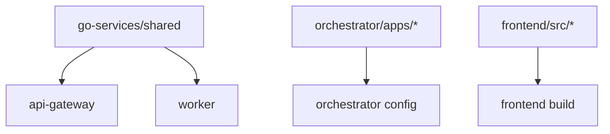

# CommandCenter1C - Инструкции для AI агентов

> Краткий обзор архитектуры и правил разработки проекта

---

## ⚠️ КРИТИЧЕСКИ ВАЖНО ДЛЯ AI АГЕНТОВ

**🎯 ВЫБРАННЫЙ ВАРИАНТ РЕАЛИЗАЦИИ: Balanced Approach (14-16 недель)**

- В документации описаны **три варианта** (MVP, Balanced, Enterprise) для полноты анализа
- **НО:** Решение принято - проект реализуется **ТОЛЬКО по варианту Balanced**
- При чтении roadmap: MVP и Enterprise - это справочная информация, НЕ план действий
- **Фокус работы:** Phases 1-5 из Balanced подхода (см. `docs/ROADMAP.md`)

> 🚨 **Не путать:** Наличие описания MVP/Enterprise вариантов НЕ означает что нужно их реализовывать. Это историческая документация для понимания альтернатив.

---

## 🎯 Проект

**CommandCenter1C** - микросервисная платформа для централизованного управления 700+ базами 1С:Бухгалтерия 3.0.

**Главная цель:** Массовые операции с данными в сотнях баз 1С параллельно с real-time мониторингом.

**Roadmap:** **Balanced approach (ВЫБРАН)** - 16 недель до production (см. `docs/ROADMAP.md`)

---

## 🏗️ Архитектура

### Высокоуровневая схема

```
┌─────────────┐
│   React     │ TypeScript + Ant Design (Port 3000)
│  Frontend   │
└──────┬──────┘
       │ HTTP + WebSocket
┌──────▼──────┐
│ Go API      │ Gin framework (Port 8080)
│ Gateway     │ Auth, Routing, Rate Limiting
└──────┬──────┘
       │ HTTP
┌──────▼──────────┐
│ Django          │ DRF + Celery (Port 8000)
│ Orchestrator    │ Business Logic, Template Engine
└────┬────────┬───┘
     │        │
  ┌──▼──┐  ┌─▼────────┐
  │Redis│  │PostgreSQL│
  │Queue│  │ Database │
  └──┬──┘  └──────────┘
     │
  ┌──▼──────┐
  │ Go      │ Goroutines pool (Scalable)
  │ Workers │ Parallel processing 100-500 bases
  └────┬────┘
       │ OData
  ┌────▼────────┐
  │ 700+ 1C     │
  │ Bases       │
  └─────────────┘
```

### Поток данных (User Operation)

```
User → Frontend → API Gateway → Orchestrator → Celery Task → Redis Queue
                                                                    ↓
1C Base ← OData Adapter ← Go Worker ← Worker Pool ← Redis Queue ←─┘
    ↓
Results → Worker → Redis → Orchestrator → WebSocket → Frontend → User
```

---

## 📁 Структура Monorepo

```
command-center-1c/
├── go-services/              # Go микросервисы
│   ├── api-gateway/          # Маршрутизация, auth, rate limiting
│   ├── worker/               # Массовая обработка с goroutines
│   └── shared/               # Общий код (auth, logger, metrics, models)
├── orchestrator/             # Python/Django - центр управления
│   ├── apps/
│   │   ├── operations/       # Логика операций
│   │   ├── databases/        # Управление базами 1С
│   │   └── templates/        # Template engine для операций
│   └── config/               # Django settings
├── frontend/                 # React UI
│   └── src/
│       ├── api/              # API client
│       ├── components/       # UI компоненты
│       ├── pages/            # Страницы приложения
│       └── stores/           # State management
├── infrastructure/           # DevOps
│   ├── docker/               # Dockerfiles
│   ├── k8s/                  # Kubernetes manifests
│   └── terraform/            # Infrastructure as Code
├── docs/                     # Документация
└── scripts/                  # Утилиты
```

---

## 🔗 Зависимости компонентов

### Build-time зависимости



### Runtime зависимости

```
api-gateway ──depends_on──> orchestrator, redis
orchestrator ──depends_on──> postgres, redis
celery-worker ──depends_on──> redis, postgres, orchestrator
worker ──depends_on──> redis
frontend ──depends_on──> api-gateway
```

**Важно:**
- API Gateway НЕ зависит от Workers
- Workers автономны, масштабируются независимо
- Frontend общается ТОЛЬКО с API Gateway

---

## 🛠️ Технологический стек

### Backend

| Компонент | Язык | Фреймворк | Назначение |
|-----------|------|-----------|------------|
| API Gateway | Go 1.21+ | Gin | HTTP routing, auth |
| Workers | Go 1.21+ | stdlib + goroutines | Parallel processing |
| Orchestrator | Python 3.11+ | Django 4.2+ | Business logic |
| Task Queue | Python 3.11+ | Celery 5.3+ | Async tasks |

### Frontend
- React 18.2+ + TypeScript
- Ant Design Pro
- Axios (HTTP) + socket.io-client (WebSocket)

### Data
- **PostgreSQL 15** - primary DB
- **Redis 7** - queue + cache
- **ClickHouse** - analytics (Phase 3)

### DevOps
- Docker + Docker Compose (dev)
- Kubernetes (production)
- Prometheus + Grafana (monitoring)

---

## 🎨 Ключевые паттерны

### 1. Template System (Orchestrator)

```json
{
  "template_id": "create_users_bulk",
  "target_entity": "Справочники_Пользователи",
  "operations": [
    {
      "action": "create",
      "fields": {
        "Наименование": "{{user.name}}",
        "ИмяПользователя": "{{user.login}}"
      }
    }
  ]
}
```

### 2. Worker Pool (Go)

```go
// Worker pool с контролируемым параллелизмом
sem := make(chan struct{}, 50) // max 50 concurrent
for _, base := range bases {
    go func(b Base) {
        sem <- struct{}{}        // acquire
        defer func() { <-sem }() // release
        processBase(b)
    }(base)
}
```

### 3. OData Integration

```python
# OData Adapter для работы с 1С
class OneCODataAdapter:
    def batch_create(self, entity, objects):
        batch = self.client.create_batch()
        for obj in objects:
            batch.create(entity, obj)
        return batch.execute()
```

---

## 📝 Правила разработки

### Соглашения о коммитах

```
[component] Короткое описание

Детальное описание (опционально)

Примеры:
[api-gateway] Add JWT authentication middleware
[orchestrator] Implement template validation logic
[frontend] Create operation execution form
[infra] Add Kubernetes deployment manifests
[docs] Update API documentation
```

### Code Organization

**Go Services:**
- `cmd/` - entry points (main.go)
- `internal/` - private application code
- `pkg/` - public libraries (если нужны)
- Используй `go-services/shared/` для общего кода

**Django Orchestrator:**
- Одно Django app = одна domain область
- Models в `models.py`, API в `views.py`, бизнес-логика в `services.py`
- Celery tasks в `tasks.py`

**Frontend:**
- Компоненты в `components/`
- Страницы в `pages/`
- API calls в `api/endpoints/`
- State management в `stores/`

### Testing Strategy

```
Unit tests:        > 70% coverage обязательно
Integration tests: Критичные flows
E2E tests:         Main user journeys (Phase 2+)
Load tests:        Phase 5 (500 баз, 50k операций)
```

---

## ⚠️ Важные ограничения

### Транзакции в 1С
**КРИТИЧНО:** Транзакции НЕ должны превышать 15 секунд!
- Разбивай длинные операции на короткие транзакции
- Один цикл = одна транзакция (для массовых операций)

### Параллелизм Workers
- Phase 1 (MVP): 10-20 workers
- Phase 2 (Balanced): 20-50 workers
- Production: Auto-scaling на основе queue depth

### Rate Limiting
- По умолчанию: 100 req/min per user
- Для массовых операций: отдельные лимиты

---

## 🚀 Quick Start для разработки

### Первый раз
```bash
cd command-center-1c
make setup      # Install dependencies
cp .env.example .env
make dev        # Start all services
```

### Ежедневная разработка
```bash
make dev        # Запустить всё
make logs       # Смотреть логи
make test       # Запустить тесты
make stop       # Остановить всё
```

### Работа с конкретным компонентом
```bash
# API Gateway
cd go-services/api-gateway
go run cmd/main.go

# Orchestrator
cd orchestrator
python manage.py runserver

# Frontend
cd frontend
npm start

# Worker
cd go-services/worker
go run cmd/main.go
```

---

## 🔍 Отладка

### Логи сервисов
```bash
make logs-api          # API Gateway
make logs-orchestrator # Django
make logs-worker       # Go Workers
make logs-frontend     # React
```

### Подключение к БД
```bash
make shell-db          # PostgreSQL psql
make shell-orchestrator # Django shell
```

### Health checks
```bash
curl http://localhost:8080/health  # API Gateway
curl http://localhost:8000/health  # Orchestrator
curl http://localhost:3000         # Frontend
```

---

## ⭐ ВЫБРАННЫЙ ПЛАН РЕАЛИЗАЦИИ

**Вариант:** Balanced Approach (14-16 недель)
**Статус:** Phase 1 - Week 1-2 (Infrastructure Setup)
**Команда:** 3-4 разработчика
**Цель:** Production-ready система с полным мониторингом

**Структура плана (Balanced):**
- **Phase 1:** MVP Foundation (Week 1-6)
- **Phase 2:** Extended Functionality (Week 7-10)
- **Phase 3:** Monitoring & Observability (Week 11-12)
- **Phase 4:** Advanced Features (Week 13-15)
- **Phase 5:** Production Hardening (Week 16)

> 📖 **Важно для AI агентов:** Проект реализуется по варианту **Balanced**. В `docs/ROADMAP.md` описаны все три варианта (MVP, Balanced, Enterprise), но работа ведется строго по Balanced плану (секция "ВАРИАНТ 2: Balanced Approach").

---

## 📊 Текущая фаза: Week 1-2

**Sprint 1.1: Project Setup (5 дней)**
- [x] Monorepo structure
- [x] Docker Compose
- [x] Makefile
- [ ] Go modules setup
- [ ] Django project setup
- [ ] React project setup
- [ ] Базовые Dockerfiles

**Следующие шаги (согласно Balanced plan):**
1. Инициализировать Go modules для api-gateway и worker
2. Создать Django проект в orchestrator/
3. Создать React app в frontend/
4. Написать Dockerfiles для каждого компонента
5. Протестировать docker-compose up

**⭐ Детальный план:** См. `docs/ROADMAP.md` - секция "ВАРИАНТ 2: Balanced Approach"

---

## 🎯 Ключевые метрики (цели)

**⭐ Balanced (Week 16) - НАШИ ЦЕЛЕВЫЕ МЕТРИКИ:**
- 200-500 баз параллельно
- 1,000+ ops/min
- 4+ типов операций
- Full monitoring (Prometheus + Grafana)
- 95%+ success rate
- 99% uptime

**Промежуточные метрики (Phase 1 - MVP Foundation, Week 6):**
- 50+ баз параллельно
- 100 ops/min
- 1 тип операций работает

---

## 🔗 Полезные ссылки

- **⭐ Roadmap (Balanced):** `docs/ROADMAP.md` - ОБЯЗАТЕЛЬНО к прочтению
- **Start Here:** `docs/START_HERE.md` - Быстрый старт
- **Executive Summary:** `docs/EXECUTIVE_SUMMARY.md` - Краткое резюме
- **Main README:** `README.md`
- **Architecture:** `docs/architecture/` (будет добавлено)
- **API Docs:** `docs/api/` (будет добавлено)

---

## 💡 Tips для AI агентов

1. **КРИТИЧНО: Работаем ТОЛЬКО по Balanced варианту** - MVP и Enterprise в roadmap для справки, НЕ реализация
2. **Всегда используй Makefile команды** вместо прямых docker команд
3. **Следуй структуре monorepo** - не создавай файлы в неправильных местах
4. **Используй shared code в Go** - не дублируй auth/logger/config между сервисами
5. **Django apps должны быть независимыми** - минимум cross-app imports
6. **Frontend общается только с API Gateway** - никаких прямых вызовов Orchestrator
7. **Транзакции 1С < 15 секунд** - это критично!
8. **Тесты обязательны** - coverage > 70%
9. **Используй paths-filter в CI** - не гоняй все тесты на каждый коммит
10. **При сомнениях в roadmap** - всегда ориентируйся на Balanced plan (Phases 1-5)

---

**Версия:** 1.1
**Последнее обновление:** 2025-01-17
**Выбранный вариант:** ⭐ Balanced Approach (14-16 недель)
**Текущая фаза:** Phase 1, Week 1-2 - Infrastructure Setup
**Следующая фаза:** Phase 1, Week 3-4 - Core Functionality
