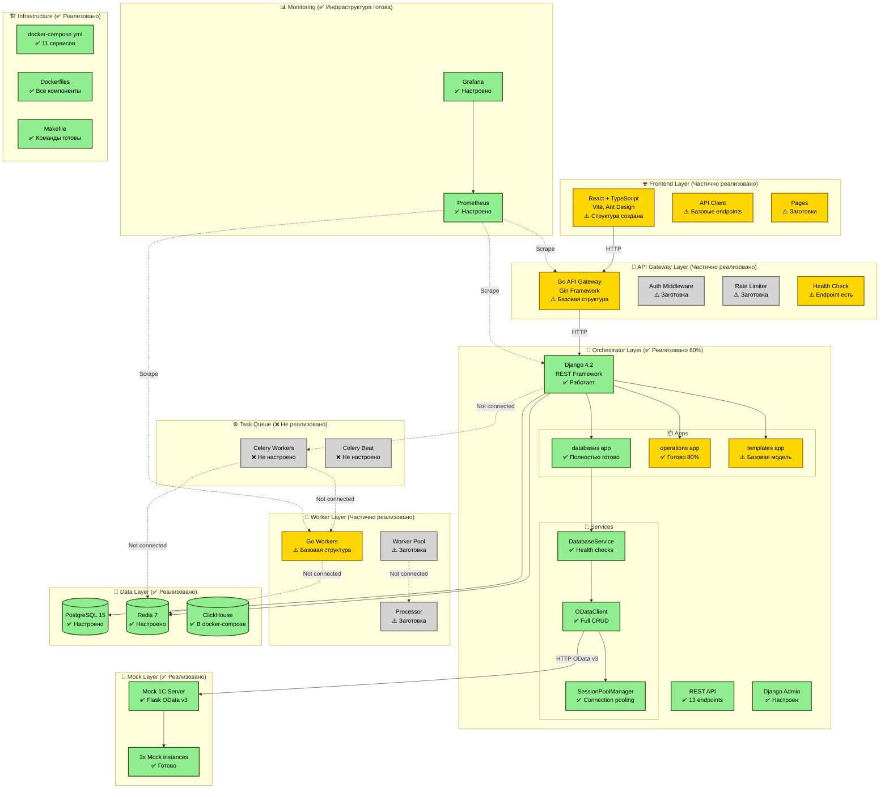

# CommandCenter1C - Текущее состояние архитектуры

**Дата:** 2025-01-17
**Фаза:** Phase 1, Week 1-2 (80% завершено)
**Статус:** Sprint 1.1 ✅ + Sprint 1.2 ✅ + Mock Server ✅

---

## 📊 Сводная диаграмма компонентов

---

## 🎨 Легенда

| Цвет | Статус | Описание |
|------|--------|----------|
| 🟢 **Зеленый** | ✅ Реализовано | Полностью работает, протестировано |
| 🟡 **Желтый** | ⚠️ Частично | Структура есть, но не полностью функционально |
| ⚪ **Серый** | ❌ Не реализовано | Только заглушка или отсутствует |
| 🔵 **Голубой** | ✅ Infrastructure | Инфраструктура настроена и работает |
| **Сплошная линия** | → | Работающая связь |
| **Пунктирная линия** | -.-> | Запланированная, но не работающая связь |

---

## 📊 Статистика по слоям

### Frontend Layer (20% готовности)
- React 18 + TypeScript setup ✅
- Ant Design Pro dependencies ✅
- Структура директорий ✅
- Компоненты и страницы ⚠️ (заглушки)
- API integration ❌

### API Gateway Layer (30% готовности)
- Go + Gin framework setup ✅
- Базовая структура ✅
- Health check endpoint ✅
- Auth middleware ⚠️ (заглушка)
- Rate limiter ⚠️ (заглушка)
- Proxy handlers ❌

### Orchestrator Layer (60% готовности)
- Django 4.2 + DRF ✅
- Database models (241 строк) ✅
- Operations models (312 строк) ✅
- OData Client (400+ строк) ✅
- REST API (13 endpoints) ✅
- Django Admin ✅
- Celery integration ❌
- Template Engine ❌

### Worker Layer (30% готовности)
- Go worker structure ✅
- Redis queue client ⚠️ (не протестирован)
- Worker pool ⚠️ (заглушка)
- Processor ❌

### Data Layer (100% готовности)
- PostgreSQL 15 ✅
- Redis 7 ✅
- ClickHouse ✅
- Migrations created ✅
- Migrations applied ❌

### Mock Layer (100% готовности)
- Flask OData v3 server ✅
- 3 mock instances ✅
- 41 automated tests ✅
- Performance: 616 req/s ✅

### Monitoring (90% готовности)
- Prometheus setup ✅
- Grafana setup ✅
- Metrics endpoints ❌
- Dashboards ⚠️ (пустые)

### Infrastructure (90% готовности)
- docker-compose.yml (11 сервисов) ✅
- Dockerfiles для всех компонентов ✅
- Makefile (20+ команд) ✅
- Networks настроены ✅

---

## 🔗 Реализованные связи

### ✅ Работают:
1. **Orchestrator ↔ PostgreSQL** - Django ORM настроен
2. **Orchestrator ↔ Redis** - конфигурация есть (Celery не подключен)
3. **ODataClient ↔ Mock 1C Server** - Full CRUD, 616 req/s
4. **Docker Compose** - все сервисы запускаются
5. **Grafana ↔ Prometheus** - мониторинг работает

### ❌ Не работают (требуют реализации):
1. **Frontend ↔ API Gateway** - нет подключения
2. **API Gateway ↔ Orchestrator** - proxy не работает
3. **Orchestrator ↔ Celery ↔ Workers** - задачи не обрабатываются
4. **Go Workers ↔ OData API** - workers не выполняют операции
5. **Prometheus ↔ Services** - metrics endpoints не реализованы

---

## 📈 Прогресс по спринтам

### Sprint 1.1: Project Setup ✅ **100% DONE**
- ✅ Monorepo structure
- ✅ Docker Compose
- ✅ Makefile
- ✅ Go modules setup
- ✅ Django project setup
- ✅ Базовые Dockerfiles

### Sprint 1.2: Database Models & OData ✅ **100% DONE**
- ✅ PostgreSQL схема (Database, BatchOperation, Task)
- ✅ Django migrations created
- ✅ Encrypted credentials
- ✅ OData Adapter (Python) - Full version
- ✅ REST API (13 endpoints)
- ✅ Django Admin interface

### Bonus: Mock Server ✅ **100% DONE**
- ✅ Flask Mock Server (284 строки)
- ✅ Docker Infrastructure
- ✅ Automated Testing (41 tests)
- ✅ Performance benchmarks (616 req/s)

### Sprint 2.1: Task Queue & Workers ❌ **0% DONE**
- ❌ Celery Setup
- ❌ Go Worker Implementation
- ❌ Orchestrator → Worker Integration

### Sprint 2.2: Template System ⚠️ **10% DONE**
- ⚠️ OperationTemplate model (базовая)
- ❌ Template Engine не реализован
- ❌ Первая операция не работает

---

## 🎯 Критические пробелы

### 1. Нет End-to-End Flow
**Проблема:** Компоненты изолированы, не могут работать вместе
**Нужно:** Frontend → Gateway → Orchestrator → Workers → 1C

### 2. Celery не настроен
**Проблема:** Нет механизма асинхронной обработки задач
**Нужно:** Celery workers + tasks.py + интеграция

### 3. Template Engine отсутствует
**Проблема:** Нельзя создавать операции через шаблоны
**Нужно:** Парсер шаблонов + валидация + engine

### 4. Integration Tests отсутствуют
**Проблема:** Только unit tests для Mock Server
**Нужно:** E2E тесты для всего flow

---

## 💪 Сильные стороны

### 1. Отличная база данных
- Полная схема с encrypted credentials
- Health tracking
- Retry logic
- Performance metrics

### 2. Качественный OData Client
- Connection pooling для 700+ баз
- Thread-safe singleton (SessionPoolManager)
- Performance: 616 req/s
- Retry logic с exponential backoff

### 3. Solid Infrastructure
- Docker Compose работает стабильно
- Makefile удобный для разработки
- Monitoring готов (Prometheus + Grafana)

### 4. Хорошая документация
- ROADMAP детальный (Balanced approach)
- CLAUDE.md для AI агентов
- API docs (Swagger)
- 6 Claude Skills готовы

---

## 🚀 Следующие шаги

### Немедленно (Week 3):
1. ✅ Применить Django migrations
2. ✅ Настроить Celery (config/celery.py + tasks.py)
3. ✅ Реализовать Go Worker Redis client
4. ✅ Первая end-to-end операция

### Ближайшее (Week 4):
5. Template Engine базовый
6. Integration tests
7. API Gateway → Orchestrator proxy
8. Frontend → Gateway connection

---

## 📝 Как просмотреть диаграмму

### Онлайн:
1. Скопируй содержимое Mermaid блока (между \`\`\`mermaid и \`\`\`)
2. Открой [Mermaid Live Editor](https://mermaid.live/)
3. Вставь код в редактор
4. Диаграмма отобразится автоматически

### В VS Code:
1. Установи расширение "Markdown Preview Mermaid Support"
2. Открой этот файл в VS Code
3. Нажми `Ctrl+Shift+V` для preview

### В GitHub:
GitHub автоматически рендерит Mermaid диаграммы в Markdown файлах.

---

## 📊 Общая статистика

| Метрика | Значение |
|---------|----------|
| **Общая готовность проекта** | 45% |
| **Phase 1, Week 1-2** | 80% ✅ |
| **Всего компонентов** | 20 |
| **Полностью реализовано** | 9 (45%) 🟢 |
| **Частично реализовано** | 7 (35%) 🟡 |
| **Не реализовано** | 4 (20%) ⚪ |
| **Строк кода** | ~12,800+ |
| **Docker сервисов** | 11 |
| **REST API endpoints** | 13 |
| **Mock Server RPS** | 616 req/s |

---

**Версия диаграммы:** 1.0
**Автор:** Architect Team
**Проект:** CommandCenter1C
**Следующий update:** После завершения Sprint 2.1
