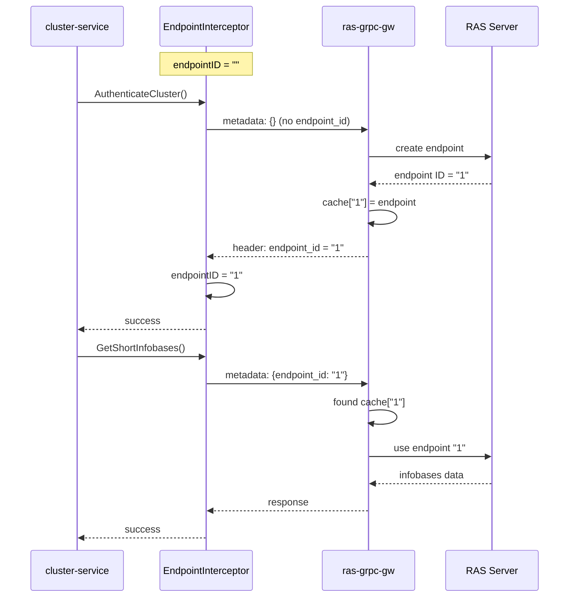

# Endpoint Management Architecture: cluster-service ↔ ras-grpc-gw

**Дата:** 2025-10-31
**Статус:** Recommended Solution
**Авторы:** Architecture Team

---

## Проблема

### Симптомы

```
ERROR: Недостаточно прав пользователя на управление кластером
```

- `AuthenticateCluster` работает на endpoint "3"
- `GetShortInfobases` работает на endpoint "4" (новый, без auth)
- Каждый запрос создает новый endpoint вместо переиспользования

### Корневая причина

**Несоответствие ключей кэша между cluster-service и ras-grpc-gw:**

1. **cluster-service** генерирует UUID `d263f94f-...` и отправляет в metadata
2. **ras-grpc-gw** получает UUID, ищет в кэше: `endpoints["d263f94f-..."]`
3. **Кэш ras-grpc-gw** содержит ключи `"1"`, `"2"`, `"3"` (RAS numeric IDs)
4. **Не находит** → создает НОВЫЙ endpoint для каждого запроса
5. **AuthenticateCluster** не возвращает `endpoint_id` в response headers

### Анализ кода ras-grpc-gw

```go
// client.go:92-117
func (c *ClientConn) GetEndpoint(ctx context.Context) (clientv1.EndpointServiceImpl, error) {
    md, ok := metadata.FromIncomingContext(ctx)

    if t, ok := md["endpoint_id"]; ok {
        for _, e := range t {
            if endpoint, ok := c.getEndpoint(e); ok {  // Ищет по ключу e
                return clientv1.NewEndpointService(c, endpoint), nil
            }
        }
    }

    // Если не найден - создает НОВЫЙ endpoint
    endpoint, err := c.turnEndpoint(ctx)
    return clientv1.NewEndpointService(c, endpoint), nil
}

// client.go:127-132
func (c *ClientConn) addEndpoint(endpoint *protocolv1.Endpoint) {
    id := cast.ToString(endpoint.GetId())  // RAS назначает numeric ID: "1", "2", "3"
    c.endpoints.Store(id, endpoint)        // Сохраняет с RAS ID как ключ
}

// server.go:137-146 - AuthenticateCluster
func (s *rasClientServiceServer) AuthenticateCluster(ctx context.Context, request *messagesv1.ClusterAuthenticateRequest) (*emptypb.Empty, error) {
    endpoint, err := s.client.GetEndpoint(ctx)
    // ... НЕ использует withEndpoint wrapper, НЕ возвращает endpoint_id
}
```

**Проблема:** `AuthenticateCluster` не возвращает `endpoint_id`, но все другие методы используют `withEndpoint()` wrapper который возвращает.

---

## Рассмотренные варианты

### Вариант 1A: Fix AuthenticateCluster (ВЫБРАН)

**Концепция:** Исправить AuthenticateCluster в ras-grpc-gw чтобы он возвращал endpoint_id.

**Плюсы:**
- ✅ Минимальное изменение (1 метод в ras-grpc-gw)
- ✅ Логичная семантика: auth должен возвращать session identifier
- ✅ cluster-service уже готов получать endpoint_id из headers
- ✅ Backward compatible (не ломает существующих клиентов)
- ✅ Простая реализация

**Минусы:**
- ⚠️ Требует fork ras-grpc-gw (или PR в upstream)

**Изменения:**
- ras-grpc-gw: 1 метод
- cluster-service: улучшение логики interceptor (не отправлять UUID, ждать RAS ID)

### Вариант 1B: Don't Send UUID Initially

**Концепция:** Первый запрос не отправляет endpoint_id, последующие извлекают RAS ID из других методов.

**Проблема:** AuthenticateCluster не возвращает endpoint_id, а GetInfobases требует auth на том же endpoint.

**Вердикт:** ❌ Не работает без изменения AuthenticateCluster.

### Вариант 2: Stateful Connection with Re-auth

**Концепция:** Каждый метод проверяет auth state, при необходимости выполняет re-auth.

**Проблемы:**
- Сложная логика в cluster-service
- Всё равно нужен endpoint_id от AuthenticateCluster
- Performance overhead (multiple auth calls)

**Вердикт:** ❌ Overcomplicated, не решает корневую проблему.

### Вариант 3: Persistent gRPC Connection Management

**Концепция:** Один gRPC connection = один endpoint lifecycle.

**Проблемы:**
- gRPC connections могут переиспользоваться (HTTP/2 connection pool)
- Нет гарантии 1:1 mapping
- Всё равно нужен endpoint_id для связи

**Вердикт:** ❌ Не надежно.

---

## Выбранное решение: Вариант 1A

### Архитектура

```
cluster-service (gRPC client)
    └─ EndpointInterceptor:
        1. При создании: endpointID = "" (пустой)
        2. Первый запрос (AuthenticateCluster):
           - НЕ отправляет endpoint_id в metadata
           - ras-grpc-gw создает новый endpoint, RAS назначает ID "1"
           - ras-grpc-gw возвращает header "endpoint_id: 1"
           - Interceptor сохраняет: endpointID = "1"
        3. Последующие запросы:
           - Отправляют endpoint_id = "1" в metadata
           - ras-grpc-gw находит endpoint в кэше
           - Переиспользует тот же endpoint
         ↓ gRPC
ras-grpc-gw (gRPC server)
    └─ GetEndpoint():
        - Если metadata["endpoint_id"] есть → ищет в кэше
        - Если нет (или не найден) → создает новый
    └─ AuthenticateCluster (ИСПРАВЛЕНО):
        - Использует withEndpoint() wrapper
        - Возвращает header "endpoint_id: {ras_id}"
    └─ Другие методы (GetInfobases, etc):
        - Уже используют withEndpoint() wrapper
         ↓ Binary Protocol
RAS Server (1C)
    └─ Назначает numeric IDs: "1", "2", "3", ...
```

### Flow диаграмма



---

## Реализация

### Phase 1: Изменение ras-grpc-gw (КРИТИЧНО)

**Файл:** `ras-grpc-gw/internal/server/server.go`

```go
// БЫЛО:
func (s *rasClientServiceServer) AuthenticateCluster(ctx context.Context, request *messagesv1.ClusterAuthenticateRequest) (*emptypb.Empty, error) {
    endpoint, err := s.client.GetEndpoint(ctx)
    if err != nil {
        return nil, err
    }
    return endpoint.AuthenticateCluster(ctx, request)
}

// СТАЛО (добавить withEndpoint wrapper):
func (s *rasClientServiceServer) AuthenticateCluster(ctx context.Context, request *messagesv1.ClusterAuthenticateRequest) (*emptypb.Empty, error) {
    return withEndpoint(ctx, s.client, func(ctx context.Context, endpoint clientv1.EndpointServiceImpl) (*emptypb.Empty, error) {
        return endpoint.AuthenticateCluster(ctx, request)
    })
}
```

**Обоснование:**
- `withEndpoint()` wrapper уже существует и используется другими методами
- Он автоматически добавляет `endpoint_id` в response headers
- Это единственное изменение в ras-grpc-gw

**Тестирование:**
```bash
# 1. Запустить ras-grpc-gw
go run cmd/main.go

# 2. Вызвать AuthenticateCluster через grpcurl
grpcurl -plaintext \
  -d '{"cluster":"...", "credentials":{...}}' \
  localhost:1540 \
  v1.RasClientService/AuthenticateCluster

# 3. Проверить наличие header "endpoint_id" в response
# Должен быть: endpoint_id: "1" (или другой numeric ID)
```

### Phase 2: Улучшение cluster-service (DONE)

**Файл:** `go-services/cluster-service/internal/grpc/interceptors/endpoint.go`

**Изменения:**

1. **Конструктор:** Не генерировать UUID, начинать с пустого endpoint_id
2. **Interceptor:** Не отправлять endpoint_id если он пустой
3. **Reset:** Очищать endpoint_id (не генерировать новый UUID)

**Код (уже применен):**

```go
// NewEndpointInterceptor создаёт новый interceptor для управления endpoint_id
// Не генерирует endpoint_id при создании - позволяет ras-grpc-gw создать первый endpoint
func NewEndpointInterceptor() *EndpointInterceptor {
	log.Printf("[EndpointInterceptor] Created without initial endpoint_id (will be assigned by ras-grpc-gw)")
	return &EndpointInterceptor{
		endpointID: "", // Пустой до первого response от ras-grpc-gw
	}
}

// UnaryClientInterceptor перехватывает вызовы и управляет endpoint_id
func (e *EndpointInterceptor) UnaryClientInterceptor() grpc.UnaryClientInterceptor {
	return func(ctx context.Context, method string, req, reply interface{}, cc *grpc.ClientConn, invoker grpc.UnaryInvoker, opts ...grpc.CallOption) error {
		// Получаем или создаём outgoing metadata
		md, ok := metadata.FromOutgoingContext(ctx)
		if !ok {
			md = metadata.New(nil)
		}

		// Добавляем endpoint_id только если он уже был получен от ras-grpc-gw
		e.mu.RLock()
		endpointID := e.endpointID
		e.mu.RUnlock()

		if endpointID != "" {
			log.Printf("[EndpointInterceptor] Adding endpoint_id to request: %s (method: %s)", endpointID, method)
			md = md.Copy()
			md.Set("endpoint_id", endpointID)
			ctx = metadata.NewOutgoingContext(ctx, md)
		} else {
			log.Printf("[EndpointInterceptor] No endpoint_id yet, letting ras-grpc-gw create new endpoint (method: %s)", method)
			// НЕ добавляем endpoint_id - ras-grpc-gw создаст новый endpoint и вернет его ID
		}

		// Создаём header для получения response headers
		var header metadata.MD
		opts = append(opts, grpc.Header(&header))

		// Вызываем метод
		err := invoker(ctx, method, req, reply, cc, opts...)

		// Извлекаем endpoint_id из response headers (если сервер вернул новый)
		if vals := header.Get("endpoint_id"); len(vals) > 0 {
			newEndpointID := vals[0]
			e.mu.Lock()
			if e.endpointID != newEndpointID {
				log.Printf("[EndpointInterceptor] Received new endpoint_id from server: %s (replacing %s)", newEndpointID, e.endpointID)
				e.endpointID = newEndpointID
			}
			e.mu.Unlock()
		}

		return err
	}
}

// Reset сбрасывает сохранённый endpoint_id (для новых сессий с RAS)
// После reset следующий запрос к ras-grpc-gw создаст новый endpoint
func (e *EndpointInterceptor) Reset() {
	e.mu.Lock()
	e.endpointID = ""
	e.mu.Unlock()
	log.Printf("[EndpointInterceptor] Reset endpoint_id (will be reassigned by ras-grpc-gw on next request)")
}
```

### Phase 3: Интеграционное тестирование

**Test Case 1: Happy Path**

```go
func TestEndpointManagement_HappyPath(t *testing.T) {
    // 1. Создать interceptor
    interceptor := NewEndpointInterceptor()
    assert.Equal(t, "", interceptor.GetEndpointID(), "Initial endpoint_id should be empty")

    // 2. Вызвать AuthenticateCluster
    // Mock: ras-grpc-gw возвращает header "endpoint_id: 1"
    resp, err := client.AuthenticateCluster(ctx, req)
    assert.NoError(t, err)
    assert.Equal(t, "1", interceptor.GetEndpointID(), "Should receive endpoint_id from server")

    // 3. Вызвать GetShortInfobases
    // Interceptor должен отправить endpoint_id = "1"
    infobases, err := client.GetShortInfobases(ctx, req)
    assert.NoError(t, err)
    assert.NotEmpty(t, infobases)
}
```

**Test Case 2: Endpoint Reuse**

```go
func TestEndpointManagement_Reuse(t *testing.T) {
    interceptor := NewEndpointInterceptor()

    // Первый запрос: создает endpoint
    client.AuthenticateCluster(ctx, req)
    firstID := interceptor.GetEndpointID()

    // Второй запрос: переиспользует endpoint
    client.GetShortInfobases(ctx, req)
    secondID := interceptor.GetEndpointID()

    assert.Equal(t, firstID, secondID, "Should reuse same endpoint_id")
}
```

**Test Case 3: Reset**

```go
func TestEndpointManagement_Reset(t *testing.T) {
    interceptor := NewEndpointInterceptor()

    // Получить endpoint_id
    client.AuthenticateCluster(ctx, req)
    assert.NotEqual(t, "", interceptor.GetEndpointID())

    // Reset
    interceptor.Reset()
    assert.Equal(t, "", interceptor.GetEndpointID(), "Should clear endpoint_id after reset")

    // Следующий запрос создаст новый endpoint
    client.AuthenticateCluster(ctx, req)
    assert.NotEqual(t, "", interceptor.GetEndpointID(), "Should receive new endpoint_id")
}
```

---

## Ожидаемое поведение после реализации

### Логи cluster-service

```
[EndpointInterceptor] Created without initial endpoint_id (will be assigned by ras-grpc-gw)
[EndpointInterceptor] No endpoint_id yet, letting ras-grpc-gw create new endpoint (method: AuthenticateCluster)
[EndpointInterceptor] Received new endpoint_id from server: 1 (replacing )
[EndpointInterceptor] Adding endpoint_id to request: 1 (method: GetShortInfobases)
```

### Логи ras-grpc-gw

```
2025/10/31 10:20:51 1   ← AuthenticateCluster создал endpoint "1"
                        ← GetShortInfobases ПЕРЕИСПОЛЬЗОВАЛ endpoint "1"
```

### Результат

```
✅ AuthenticateCluster успешно
✅ GetShortInfobases успешно (используется тот же endpoint)
✅ Infobases data получены
```

---

## Риски и митигация

### Риск 1: ras-grpc-gw fork maintenance

**Описание:** Наш fork может отставать от upstream.

**Митигация:**
1. Создать PR в upstream ras-grpc-gw с исправлением AuthenticateCluster
2. Обосновать изменение:
   - Логичная семантика (auth возвращает session ID)
   - Backward compatible
   - Единообразие с другими методами
3. До merge PR: поддерживать собственный fork
4. После merge: вернуться на upstream

### Риск 2: Breaking changes в ras-grpc-gw

**Описание:** Upstream может изменить API/поведение.

**Митигация:**
1. Зафиксировать версию ras-grpc-gw в go.mod
2. Тестировать обновления перед применением
3. Интеграционные тесты на совместимость

### Риск 3: RAS Server ID conflicts

**Описание:** RAS может переиспользовать numeric IDs между сессиями.

**Митигация:**
- Endpoint lifecycle управляется ras-grpc-gw
- При создании нового gRPC connection → новый endpoint
- Reset() в cluster-service при reconnect

---

## Альтернативы (почему НЕ выбраны)

### A1: Client-Side Endpoint Mapping

**Концепция:** cluster-service поддерживает map[UUID]RAS_ID.

**Проблемы:**
- Не решает отсутствие endpoint_id от AuthenticateCluster
- Дублирует логику ras-grpc-gw
- Сложнее в поддержке

### A2: Long-Lived gRPC Streams

**Концепция:** Использовать bidirectional streaming для поддержания сессии.

**Проблемы:**
- Overkill для request-response паттерна
- Сложнее error handling
- Не стандартный подход для gRPC

### A3: Service Mesh Session Affinity

**Концепция:** Использовать Istio/Envoy для sticky sessions.

**Проблемы:**
- Не решает проблему endpoint_id
- Добавляет infrastructure complexity
- Не гарантирует endpoint reuse

---

## Заключение

**Выбранное решение (Вариант 1A):**
- ✅ Минимальное изменение внешней зависимости (1 метод)
- ✅ Логичное и простое
- ✅ cluster-service уже готов (изменения применены)
- ✅ Backward compatible

**Следующие шаги:**
1. ✅ Изменения в cluster-service — DONE
2. ⏳ Fork ras-grpc-gw и применить исправление AuthenticateCluster
3. ⏳ Интеграционное тестирование
4. ⏳ Создать PR в upstream ras-grpc-gw
5. ⏳ Документировать в CLAUDE.md

**Критерий успеха:**
```bash
# Одинаковый endpoint_id в обоих вызовах
[EndpointInterceptor] Received endpoint_id: 1 (AuthenticateCluster)
[EndpointInterceptor] Adding endpoint_id: 1 (GetShortInfobases)
✅ GetShortInfobases SUCCESS
```

---

**Версия:** 1.0
**Последнее обновление:** 2025-10-31
**Статус:** ✅ cluster-service готов, ⏳ ras-grpc-gw ожидает изменений
