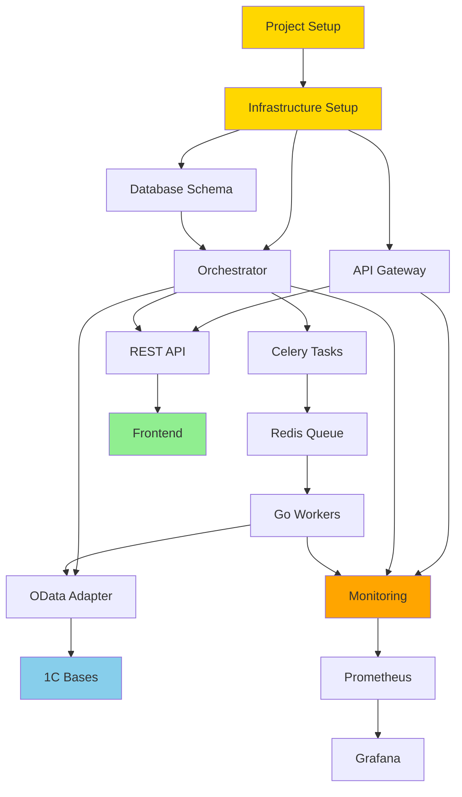
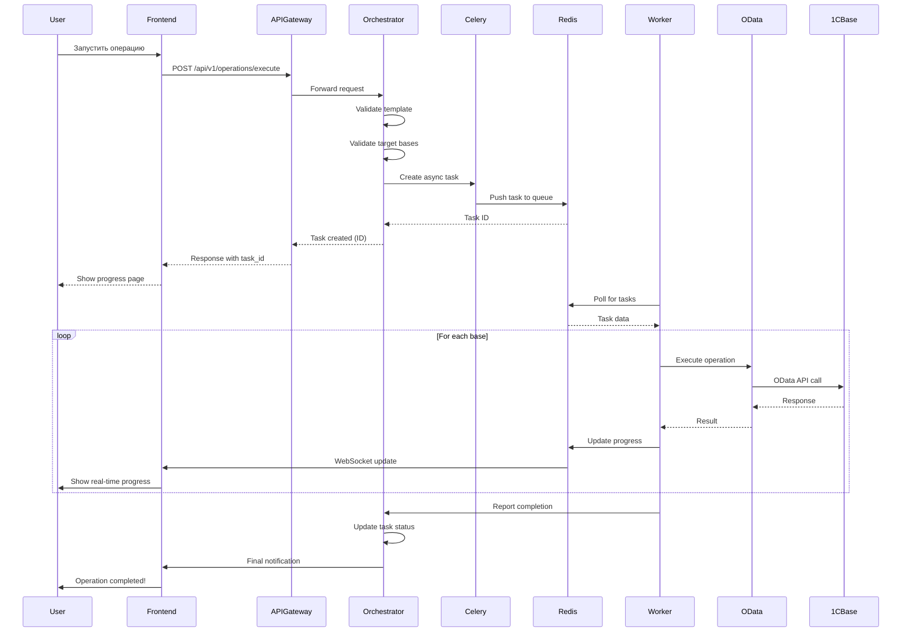

# 📊 ROADMAP: Визуализация и диаграммы

> **Дополнение к основному ROADMAP.md - графическое представление фаз разработки**

---

## 📅 Timeline Visualization

### Вариант 1: Quick MVP (6-8 недель)

```
Week 1-2: Infrastructure          ████████ (16 дней)
├─ Sprint 1.1: Project Setup      ████░░░░ (5 дней)
└─ Sprint 1.2: DB & OData         ░░░░████ (5 дней)

Week 3-4: Core Functionality      ████████ (10 дней)
├─ Sprint 2.1: Workers            ████░░░░ (5 дней)
└─ Sprint 2.2: Templates          ░░░░████ (5 дней)

Week 5-6: API & Frontend          ████████ (10 дней)
├─ Sprint 3.1: REST API           ████░░░░ (5 дней)
└─ Sprint 3.2: Basic UI           ░░░░████ (5 дней)

Week 7-8: Testing & Deploy        ████████ (8 дней)
├─ Sprint 4.1: Production Ready   █████░░░ (5 дней)
└─ Sprint 4.2: Load Testing       ░░░░░███ (3 дня)
```

**Total: 44 рабочих дня (6.3 недели при 7-часовом рабочем дне)**

### Вариант 2: Balanced (14-16 недель)

```
┌─────────────────────────────────────────────────────────────────────────┐
│ Phase 1: MVP Foundation (Weeks 1-6)                                      │
│ ████████████████████████░░░░░░░░░░░░░░░░░░░░░░░░░░░░░░░░░░░░░░░░░░░░░ │
└─────────────────────────────────────────────────────────────────────────┘
┌─────────────────────────────────────────────────────────────────────────┐
│ Phase 2: Extended Functionality (Weeks 7-10)                             │
│ ░░░░░░░░░░░░░░░░░░░░░░░████████████████░░░░░░░░░░░░░░░░░░░░░░░░░░░░░░ │
└─────────────────────────────────────────────────────────────────────────┘
┌─────────────────────────────────────────────────────────────────────────┐
│ Phase 3: Monitoring & Observability (Weeks 11-12)                        │
│ ░░░░░░░░░░░░░░░░░░░░░░░░░░░░░░░░░░░░░░░████████░░░░░░░░░░░░░░░░░░░░░░ │
└─────────────────────────────────────────────────────────────────────────┘
┌─────────────────────────────────────────────────────────────────────────┐
│ Phase 4: Advanced Features (Weeks 13-15)                                 │
│ ░░░░░░░░░░░░░░░░░░░░░░░░░░░░░░░░░░░░░░░░░░░░░░░░████████████░░░░░░░░░ │
└─────────────────────────────────────────────────────────────────────────┘
┌─────────────────────────────────────────────────────────────────────────┐
│ Phase 5: Production Hardening (Week 16)                                  │
│ ░░░░░░░░░░░░░░░░░░░░░░░░░░░░░░░░░░░░░░░░░░░░░░░░░░░░░░░░░░░░░░░░████ │
└─────────────────────────────────────────────────────────────────────────┘
```

**Total: ~110 рабочих дней (15.7 недель)**

### Вариант 3: Enterprise (22-26 недель)

```
┌───────────────────────────────────────────────┐
│ Phases 1-4 (Weeks 1-15)                       │
│ █████████████████████████░░░░░░░░░░░░░░░░░░░ │
└───────────────────────────────────────────────┘
┌───────────────────────────────────────────────┐
│ Phase 5: Enterprise Features (Weeks 16-20)    │
│ ░░░░░░░░░░░░░░░░░░░░░░░░░██████████░░░░░░░░░ │
└───────────────────────────────────────────────┘
┌───────────────────────────────────────────────┐
│ Phase 6: AI/ML Integration (Weeks 21-23)      │
│ ░░░░░░░░░░░░░░░░░░░░░░░░░░░░░░░░░░░██████░░░ │
└───────────────────────────────────────────────┘
┌───────────────────────────────────────────────┐
│ Phase 7: Enterprise Hardening (Weeks 24-26)   │
│ ░░░░░░░░░░░░░░░░░░░░░░░░░░░░░░░░░░░░░░░░█████│
└───────────────────────────────────────────────┘
```

**Total: ~170 рабочих дней (24.3 недели)**

---

## 🏗️ Архитектура компонентов

### Dependency Graph



### Development Phases Flow

```mermaid
graph LR
    subgraph "MVP Phase"
        A1[Infrastructure] --> A2[Core Logic]
        A2 --> A3[API & UI]
        A3 --> A4[Testing]
    end

    subgraph "Extended Phase"
        B1[Templates] --> B2[Workers]
        B2 --> B3[UI Advanced]
    end

    subgraph "Monitoring Phase"
        C1[Prometheus] --> C2[Grafana]
        C2 --> C3[Logging]
    end

    subgraph "Advanced Phase"
        D1[Security] --> D2[Integration]
    end

    A4 --> B1
    B3 --> C1
    C3 --> D1

    style A1 fill:#FFE4B5
    style A2 fill:#FFE4B5
    style A3 fill:#FFE4B5
    style A4 fill:#FFE4B5
    style B1 fill:#E0FFFF
    style B2 fill:#E0FFFF
    style B3 fill:#E0FFFF
    style C1 fill:#F0E68C
    style C2 fill:#F0E68C
    style C3 fill:#F0E68C
    style D1 fill:#DDA0DD
    style D2 fill:#DDA0DD
```



---

## 📊 Сравнительные таблицы

### Детальное сравнение вариантов

#### Функциональность

| Функция | MVP | Balanced | Enterprise |
|---------|-----|----------|------------|
| **Базовые операции** | ✅ 1 тип | ✅ 4+ типов | ✅ Unlimited |
| **Система шаблонов** | 🟡 Простая | ✅ Расширенная | ✅ Workflow engine |
| **Real-time мониторинг** | 🟡 Базовый | ✅ WebSocket | ✅ Full observability |
| **API** | ✅ REST | ✅ REST + docs | ✅ REST + GraphQL |
| **Authentication** | 🟡 Basic JWT | ✅ JWT + RBAC | ✅ SSO + AD + MFA |
| **Масштабирование** | 🟡 Manual | ✅ Auto-scale | ✅ Multi-region |
| **Мониторинг** | 🟡 Logs | ✅ Prometheus + Grafana | ✅ Full stack + Tracing |
| **Аналитика** | ❌ | 🟡 ClickHouse basic | ✅ ClickHouse + BI |
| **Backup/Recovery** | 🟡 Manual | ✅ Automated | ✅ DR + Multi-region |
| **Multi-tenancy** | ❌ | ❌ | ✅ Full support |
| **AI/ML** | ❌ | ❌ | ✅ Predictions + Optimization |
| **Plugin system** | ❌ | ❌ | ✅ Full plugin support |

**Легенда:**
- ✅ Полная поддержка
- 🟡 Частичная поддержка / Упрощенная версия
- ❌ Не поддерживается

#### Технические характеристики

| Характеристика | MVP | Balanced | Enterprise |
|----------------|-----|----------|------------|
| **Max параллельных баз** | 100 | 500 | 1000+ |
| **Throughput (ops/min)** | 100 | 1000 | 5000+ |
| **API Latency (p95)** | < 2s | < 1s | < 500ms |
| **Success Rate** | > 90% | > 95% | > 99% |
| **Uptime SLA** | 95% | 99% | 99.9% |
| **MTTR** | < 4h | < 1h | < 15min |
| **Concurrent Workers** | 10-20 | 20-50 | 50-100+ |
| **DB Connections per base** | 3 | 5 | 5-10 |
| **Redis Queue Size** | 10k | 100k | 1M+ |
| **Storage (PostgreSQL)** | 10GB | 100GB | 1TB+ |
| **Storage (ClickHouse)** | - | 50GB | 500GB+ |

#### Ресурсы и стоимость

| Ресурс | MVP | Balanced | Enterprise |
|--------|-----|----------|------------|
| **Команда (FTE)** | 2-3 | 3-4 | 4-6 |
| **Go Engineers** | 0.5 | 1 | 2 |
| **Python Engineers** | 1 | 1 | 1-2 |
| **Frontend Engineers** | 0.5 | 1 | 1 |
| **DevOps** | 0.25 | 0.5 | 1 |
| **QA** | 0.25 | 0.5 | 1 |
| **Инфраструктура (месяц)** | $200-500 | $1000-2000 | $5000-10000 |
| **CPU (cores)** | 8-16 | 32-64 | 128+ |
| **Memory (GB)** | 16-32 | 64-128 | 256+ |
| **Storage (TB)** | 0.5 | 2 | 10+ |

#### Риски и сложность

| Аспект | MVP | Balanced | Enterprise |
|--------|-----|----------|------------|
| **Техническая сложность** | 🟢 Низкая | 🟡 Средняя | 🔴 Высокая |
| **Риск провала** | 🟢 Низкий | 🟡 Средний | 🔴 Высокий |
| **Время до первого релиза** | 🟢 6-8 недель | 🟡 14-16 недель | 🔴 22-26 недель |
| **Требования к expertise** | 🟢 Junior-Mid | 🟡 Mid-Senior | 🔴 Senior+ |
| **Сложность поддержки** | 🟢 Простая | 🟡 Умеренная | 🔴 Сложная |
| **Vendor lock-in** | 🟢 Минимальный | 🟢 Минимальный | 🟡 Умеренный |

---

## 🎯 Decision Matrix

### Scoring Model

Каждый вариант оценивается по 10 критериям (0-10 баллов):

| Критерий | Вес | MVP | Balanced | Enterprise |
|----------|-----|-----|----------|------------|
| **Time to Market** | 20% | 10 | 7 | 3 |
| **Cost Efficiency** | 15% | 10 | 7 | 4 |
| **Scalability** | 20% | 4 | 8 | 10 |
| **Feature Completeness** | 15% | 3 | 8 | 10 |
| **Risk Level** | 10% | 9 | 7 | 4 |
| **Maintainability** | 10% | 6 | 8 | 9 |
| **Team Availability** | 5% | 9 | 7 | 5 |
| **Future-proofing** | 5% | 4 | 7 | 10 |

**Weighted Score:**
- **MVP:** (10×0.2 + 10×0.15 + 4×0.2 + 3×0.15 + 9×0.1 + 6×0.1 + 9×0.05 + 4×0.05) = **7.0**
- **Balanced:** (7×0.2 + 7×0.15 + 8×0.2 + 8×0.15 + 7×0.1 + 8×0.1 + 7×0.05 + 7×0.05) = **7.5** ⭐
- **Enterprise:** (3×0.2 + 4×0.15 + 10×0.2 + 10×0.15 + 4×0.1 + 9×0.1 + 5×0.05 + 10×0.05) = **6.85**

### Визуализация scores

```
MVP:        ███████░░░ 7.0
Balanced:   ████████░░ 7.5 ⭐ RECOMMENDED
Enterprise: ███████░░░ 6.85
```

---

## 📈 ROI Analysis

### Инвестиции vs. Value

```
           Value
            │
       10 │                    ┌─────────┐
            │                    │Enterprise│
        9 │                    └─────────┘
            │
        8 │         ┌─────────┐
            │         │Balanced │ ⭐
        7 │         └─────────┘
            │
        6 │  ┌─────────┐
            │  │   MVP   │
        5 │  └─────────┘
            │
        4 │
            └─────────────────────────────────── Investment
            5     10    15    20    25    30
```

**ROI Calculation (примерная):**

**MVP:**
- Investment: $50k-75k (2-3 devs × 2 months)
- Value: Proof of concept, 100 баз
- ROI: Быстрая валидация, но ограниченная ценность

**Balanced:** ⭐
- Investment: $150k-200k (3-4 devs × 4 months)
- Value: Production system, 500 баз, мониторинг
- ROI: **Лучший баланс** - production-ready за разумную цену

**Enterprise:**
- Investment: $400k-600k (4-6 devs × 6 months)
- Value: Enterprise система, 1000+ баз, AI/ML, multi-tenancy
- ROI: Максимальная ценность, но высокая стоимость и риск

### Break-even Analysis

Предположим, платформа экономит **2 часа ручной работы на каждую массовую операцию**.

**При стоимости часа работы $50:**

```
Операций в месяц: 100
Экономия: 100 × 2h × $50 = $10,000/месяц

Break-even:
- MVP: ~6 месяцев ($75k / $10k)
- Balanced: ~15-20 месяцев ($200k / $10k)
- Enterprise: ~40-60 месяцев ($600k / $10k)
```

**Вывод:** Balanced вариант окупается за разумный срок при активном использовании.

---

## 🔄 Migration Path

### Incremental Approach

Рекомендуемая стратегия: **Start with MVP → Evolve to Balanced**

```
┌─────────┐         ┌─────────┐         ┌─────────┐
│   MVP   │ ─────→  │Balanced │ ─────→  │Enterprise│
│ 6 weeks │         │+8 weeks │         │+8 weeks  │
└─────────┘         └─────────┘         └─────────┘
   ↓                    ↓                    ↓
Validate           Production          Enterprise
Concept            System              Features
```

**Миграция MVP → Balanced (8 недель):**

| Week | Focus | Deliverable |
|------|-------|-------------|
| 1-2 | Extended Templates | 4+ operation types |
| 3-4 | Worker Scaling | Auto-scaling, error handling |
| 5-6 | Monitoring | Prometheus + Grafana |
| 7-8 | Security | RBAC, audit logging |

**Advantage:** Валидация концепции перед большими инвестициями

**Disadvantage:** Rework некоторых компонентов

---

## 🎭 Use Case Scenarios

### Scenario 1: Startup/Small Company (< 200 баз)

**Рекомендация:** MVP → Balanced (if successful)

```
Начальная ситуация:
- 150 баз 1С
- Операции: создание пользователей, изменение номеров
- Частота: 2-3 раза в месяц
- Команда: 2-3 разработчика

Выбор: MVP (6-8 недель)
Затем: Добавить мониторинг и дополнительные операции (Balanced)

Timeline:
Month 1-2: MVP Development
Month 3: Testing & Deployment
Month 4-6: Usage & Feedback
Month 7-10: Upgrade to Balanced (if needed)
```

### Scenario 2: Medium Company (200-600 баз)

**Рекомендация:** Balanced

```
Начальная ситуация:
- 400 баз 1С
- Операции: множество типов (пользователи, документы, товары)
- Частота: ежедневно
- Команда: 3-4 разработчика
- Требования: мониторинг, reliability

Выбор: Balanced (14-16 недель)

Timeline:
Month 1-2: MVP Foundation
Month 3-4: Extended Functionality + Monitoring
Month 5: Production Deployment
Month 6+: Continuous Improvement
```

### Scenario 3: Large Enterprise (600+ баз)

**Рекомендация:** Balanced → Enterprise

```
Начальная ситуация:
- 1000+ баз 1С
- Операции: сложные workflows
- Частота: постоянно (24/7)
- Команда: 5-6 разработчиков
- Требования: HA, multi-tenancy, compliance

Выбор: Balanced (16 недель) + Enterprise Features (10 недель)

Timeline:
Month 1-4: Balanced Development
Month 5: Initial Production Deployment
Month 6-8: Enterprise Features (Multi-tenancy, HA)
Month 9-10: AI/ML Integration
Month 11+: Continuous Enhancement
```

---

## 🚦 Go/No-Go Decision Points

### Checkpoint 1: После MVP (Week 8)

**Evaluate:**
- ✅ Платформа работает с 50+ базами?
- ✅ Успешно выполнено 1000+ операций?
- ✅ Пользователи довольны базовым функционалом?
- ✅ Performance приемлемый?

**Decision:**
- **GO:** Переходим к Extended Functionality
- **NO-GO:** Pivot или пересмотр архитектуры

### Checkpoint 2: После Balanced (Week 16)

**Evaluate:**
- ✅ Production deployment успешен?
- ✅ Обрабатываем 200+ баз без проблем?
- ✅ Uptime > 99%?
- ✅ Feedback пользователей положительный?
- ✅ ROI в пределах ожиданий?

**Decision:**
- **GO:** Рассмотреть Enterprise Features
- **MAINTAIN:** Остаться на Balanced, continuous improvement
- **NO-GO:** Редизайн или pivot

### Checkpoint 3: После Enterprise (Week 26)

**Evaluate:**
- ✅ Multi-tenancy работает?
- ✅ AI/ML модели дают value?
- ✅ Масштабирование до 1000+ баз?
- ✅ Соответствие enterprise требованиям?

**Decision:**
- **SUCCESS:** Production rollout, continuous improvement
- **PARTIAL SUCCESS:** Focus на ключевых features
- **ISSUES:** Troubleshooting и optimization

---

## 📋 Sprint Planning Template

### Sprint Structure (2-week sprints)

```
Sprint N: [Sprint Name]
Duration: 2 weeks (10 working days)
Team: [List team members]

┌─────────────────────────────────────────────────┐
│ Monday (Day 1)                                   │
│ - Sprint Planning (2h)                           │
│ - Task breakdown                                 │
│ - Story pointing                                 │
└─────────────────────────────────────────────────┘

┌─────────────────────────────────────────────────┐
│ Tuesday-Thursday (Days 2-9)                      │
│ - Daily standups (15min)                         │
│ - Development work                               │
│ - Code reviews                                   │
│ - Testing                                        │
└─────────────────────────────────────────────────┘

┌─────────────────────────────────────────────────┐
│ Friday (Day 10)                                  │
│ - Sprint Review/Demo (1h)                        │
│ - Sprint Retrospective (1h)                      │
│ - Sprint closure                                 │
└─────────────────────────────────────────────────┘
```

### Story Points Estimation

```
1 point  = 1-2 hours   (trivial)
2 points = 2-4 hours   (simple)
3 points = 4-8 hours   (medium)
5 points = 1-2 days    (complex)
8 points = 2-4 days    (very complex)
13 points = 1 week+    (epic, needs breakdown)
```

**Team Velocity:**
- New team: 20-30 points/sprint (2 weeks)
- Established team: 40-60 points/sprint
- High-performing team: 70+ points/sprint

---

## 🎨 Mermaid Diagram: Complete System Flow



---

## 🏁 Conclusion

### Quick Decision Guide

**Выберите:**

```
If (budget_limited AND team_small AND need_POC):
    → Choose MVP

Elif (production_system AND moderate_scale AND balanced_approach):
    → Choose BALANCED ⭐ RECOMMENDED

Elif (enterprise_requirements AND large_scale AND long_term):
    → Choose ENTERPRISE

Else:
    → Start with MVP, evolve to BALANCED
```

### Success Factors

**Critical Success Factors:**
1. ✅ **Strong team** с expertise в Go, Python, React
2. ✅ **Clear requirements** и scope definition
3. ✅ **Stakeholder buy-in** и support
4. ✅ **Access to test environments** (1С базы)
5. ✅ **Incremental delivery** и feedback loops
6. ✅ **Focus on quality** (tests, monitoring, documentation)

### Red Flags

**Warning signs to watch:**
- 🚩 Scope creep (добавление features без prioritization)
- 🚩 Poor team communication
- 🚩 Недостаток testing environments
- 🚩 Технический debt accumulation
- 🚩 Отсутствие code reviews
- 🚩 Performance issues ignored

---

**Документ готов к использованию в связке с основным ROADMAP.md!**

**Next Steps:**
1. Review обоих документов с командой
2. Выбор варианта реализации
3. Детализация первого спринта
4. Kickoff meeting

**Версия:** 1.0
**Дата:** 2025-01-17
