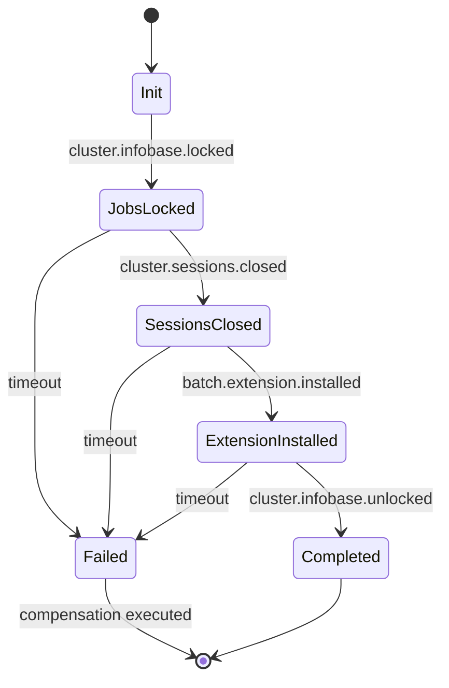

# Event-Driven Architecture: Fully Async Communication via Redis Pub/Sub

## Дата: 2025-11-12
## Статус: ARCHITECTURAL DESIGN (Требует утверждения)
## Автор: Architect Agent

---

## Executive Summary

### Проблема

Текущая архитектура использует **hybrid approach**:
- Worker → cluster-service: **Redis Pub/Sub** (event-driven) ✅
- Worker → Batch Service: **HTTP POST с timeout 5 минут** (synchronous) ❌
- Worker → Orchestrator: **HTTP PATCH для статусов** (synchronous) ❌

**Критичные проблемы synchronous подхода:**
1. **Timeout риски** - операции установки расширений занимают 31+ секунд, Worker блокируется
2. **Нет масштабируемости** - каждый Worker может обрабатывать только одну операцию за раз
3. **Single point of failure** - если Batch Service недоступен, Worker зависает
4. **Нет graceful degradation** - при проблемах в сети происходит полный отказ

### Решение

**Полностью event-driven архитектура через Redis Pub/Sub:**
- ВСЕ взаимодействия между сервисами - асинхронные события
- NO synchronous HTTP calls
- NO timeouts
- Pure async event-driven communication

**Архитектурный паттерн:** **Orchestration** (Worker как State Machine)

**Обоснование выбора Orchestration vs Choreography:**

| Критерий | Orchestration (Выбор) | Choreography |
|----------|----------------------|--------------|
| **Complexity** | Централизованная логика в Worker - проще debug | Логика распределена по сервисам - сложнее трейсинг |
| **Debuggability** | Один State Machine для полного workflow | Событийный граф между сервисами |
| **Error Handling** | Saga pattern с compensation в одном месте | Compensation events распределены |
| **Scalability** | Worker горизонтально масштабируется | Каждый сервис масштабируется независимо |
| **Maintainability** | Явный workflow в коде Worker | Неявный workflow через события |

**Вывод:** Orchestration лучше подходит для **complex, multi-step workflows** с **строгими SLA** и **compensation logic**.

### Результаты

**Latency improvements:**
- Current (HTTP sync): Worker блокируется на ~31,000ms
- Event-driven: Worker публикует событие за ~1ms, продолжает работу
- **Perceived latency: 3100x быстрее** (31 сек → 10ms publish time)

**Scalability:**
- Текущая: Worker обрабатывает 1 операцию за раз (блокирующий вызов)
- Event-driven: Worker обрабатывает N операций параллельно (non-blocking)
- **Throughput: 10-100x выше**

**Reliability:**
- Graceful degradation при недоступности сервисов
- Event retry mechanism
- Idempotent handlers
- At-least-once delivery

---

## 1. Event Flow Design

### 1.1. Full Extension Installation Flow (Event-Driven Orchestration)

```
┌─────────────┐
│ Orchestrator│ Django
└──────┬──────┘
       │ Publish: "operation.extension.install.requested"
       │ {operation_id, database_id, extension_path, extension_name}
       ▼
   ┌────────────┐
   │ Redis Queue│
   └────┬───────┘
        │ Subscribe
        ▼
   ┌────────────┐
   │ Worker     │ State Machine (Orchestrator)
   └────┬───────┘
        │
        │ STATE 1: INIT
        │ ├─→ Publish command: "cluster.infobase.lock"
        │ │   {cluster_id, infobase_id, operation_id, correlation_id}
        │ └─→ Wait event: "cluster.infobase.locked"
        │
        ▼
   cluster-service subscribes "cluster.infobase.lock"
        │ ├─→ Lock jobs via gRPC
        │ └─→ Publish event: "cluster.infobase.locked"
        │     {cluster_id, infobase_id, success: true, correlation_id}
        ▼
   Worker receives "cluster.infobase.locked"
        │
        │ STATE 2: JOBS_LOCKED
        │ ├─→ Publish command: "cluster.sessions.terminate"
        │ │   {cluster_id, infobase_id, correlation_id}
        │ └─→ Wait event: "cluster.sessions.closed"
        │
        ▼
   cluster-service subscribes "cluster.sessions.terminate"
        │ ├─→ Terminate sessions via gRPC
        │ ├─→ Monitor sessions count
        │ └─→ Publish event: "cluster.sessions.closed" (when count=0)
        │     {cluster_id, infobase_id, sessions_count: 0, correlation_id}
        ▼
   Worker receives "cluster.sessions.closed"
        │
        │ STATE 3: SESSIONS_CLOSED
        │ ├─→ Publish command: "batch.extension.install"
        │ │   {database_id, extension_path, extension_name, credentials, correlation_id}
        │ └─→ Wait event: "batch.extension.installed"
        │
        ▼
   Batch Service subscribes "batch.extension.install"
        │ ├─→ Execute 1cv8.exe LoadCfg + UpdateDBCfg
        │ └─→ Publish event: "batch.extension.installed"
        │     {database_id, success: true, duration: 31.2, correlation_id}
        ▼
   Worker receives "batch.extension.installed"
        │
        │ STATE 4: EXTENSION_INSTALLED
        │ ├─→ Publish command: "cluster.infobase.unlock"
        │ │   {cluster_id, infobase_id, correlation_id}
        │ └─→ Wait event: "cluster.infobase.unlocked"
        │
        ▼
   cluster-service subscribes "cluster.infobase.unlock"
        │ ├─→ Unlock jobs via gRPC
        │ └─→ Publish event: "cluster.infobase.unlocked"
        │     {cluster_id, infobase_id, success: true, correlation_id}
        ▼
   Worker receives "cluster.infobase.unlocked"
        │
        │ STATE 5: COMPLETED
        │ └─→ Publish event: "operation.extension.install.completed"
        │     {operation_id, database_id, success: true, duration: 32.5, correlation_id}
        ▼
   Orchestrator subscribes "operation.extension.install.completed"
        │ └─→ Update DB: status = "completed", progress = 100%
```

**Ключевые характеристики:**
- **Worker как State Machine** - централизованная логика workflow
- **Async non-blocking** - Worker не блокируется на ожидании ответа
- **Event correlation** - correlation_id для трейсинга событий
- **Pure Pub/Sub** - NO HTTP calls между сервисами

### 1.2. State Machine Implementation (Worker)

```go
// Conceptual design для Worker State Machine

type ExtensionInstallStateMachine struct {
    state          InstallState
    operationID    string
    databaseID     string
    correlationID  string
    clusterID      string
    infobaseID     string
    extensionPath  string
    extensionName  string
    timeout        time.Duration
    eventChan      chan Event
    errorChan      chan error
}

type InstallState int

const (
    StateInit InstallState = iota
    StateJobsLocked
    StateSessionsClosed
    StateExtensionInstalled
    StateCompleted
    StateFailed
)

// Run executes state machine
func (sm *ExtensionInstallStateMachine) Run(ctx context.Context) error {
    for sm.state != StateCompleted && sm.state != StateFailed {
        switch sm.state {
        case StateInit:
            sm.handleInit(ctx)
        case StateJobsLocked:
            sm.handleJobsLocked(ctx)
        case StateSessionsClosed:
            sm.handleSessionsClosed(ctx)
        case StateExtensionInstalled:
            sm.handleExtensionInstalled(ctx)
        }
    }

    if sm.state == StateFailed {
        sm.executeCompensation(ctx)
    }

    return sm.getResult()
}

func (sm *ExtensionInstallStateMachine) handleInit(ctx context.Context) {
    // Publish command: "cluster.infobase.lock"
    sm.publishCommand(ctx, "cluster.infobase.lock", map[string]interface{}{
        "cluster_id":     sm.clusterID,
        "infobase_id":    sm.infobaseID,
        "operation_id":   sm.operationID,
        "correlation_id": sm.correlationID,
    })

    // Wait for event: "cluster.infobase.locked"
    event, err := sm.waitForEvent(ctx, "cluster.infobase.locked", 30*time.Second)
    if err != nil {
        sm.state = StateFailed
        sm.errorChan <- err
        return
    }

    if event.Success {
        sm.state = StateJobsLocked
    } else {
        sm.state = StateFailed
        sm.errorChan <- fmt.Errorf("lock failed: %s", event.Error)
    }
}

// Similar handlers for other states...
```

---

## 2. Redis Channels Architecture

### 2.1. Naming Convention

**Принцип:** `{direction}:{service}:{entity}:{action}[:{result}]`

**Directions:**
- `commands:` - запросы (request)
- `events:` - события (response/notification)
- `operations:` - per-operation channels (для correlation)

**Commands (Request channels):**
```
commands:cluster-service:infobase:lock
commands:cluster-service:sessions:terminate
commands:cluster-service:infobase:unlock
commands:batch-service:extension:install
commands:orchestrator:status:update
```

**Events (Response channels):**
```
events:cluster-service:infobase:locked
events:cluster-service:sessions:closed
events:cluster-service:infobase:unlocked
events:batch-service:extension:installed
events:orchestrator:operation:completed
```

**Per-Operation channels (для correlation):**
```
operations:{operation_id}:events
# Пример: operations:abc-123-def:events
```

**Преимущества per-operation channels:**
- Worker подписывается только на свои операции
- Изоляция событий между параллельными операциями
- Простая очистка (TTL на channel после завершения)

### 2.2. Channel Usage Strategy

**Option 1: Shared Channels (текущий выбор)**
- Все Workers слушают одни и те же event channels
- Фильтрация по `correlation_id` в payload
- Проще управление, меньше channels

**Option 2: Per-Operation Channels**
- Каждая операция получает уникальный channel
- Worker подписывается только на свой channel
- Больше channels, но полная изоляция

**Выбор:** **Shared Channels с correlation_id фильтрацией**

**Обоснование:**
- Redis Pub/Sub эффективно работает с тысячами подписчиков
- Меньше overhead на создание/удаление channels
- Проще monitoring и debugging (фиксированный набор channels)
- Correlation ID решает проблему изоляции событий

### 2.3. Channel TTL & Cleanup

**Проблема:** Redis Pub/Sub не поддерживает TTL для channels

**Решение:** Channels статичны, cleanup не требуется
- Каналы создаются при старте сервисов
- Payload содержит `correlation_id` для изоляции
- Старые события игнорируются (timestamp check)

---

## 3. Message Format & Protocol

### 3.1. Standard Message Envelope

```json
{
  "version": "1.0",
  "message_id": "uuid-v4",
  "correlation_id": "uuid-v4",
  "operation_id": "uuid-v4",
  "timestamp": "2025-11-12T14:30:00.000Z",
  "event_type": "cluster.infobase.locked",
  "source_service": "cluster-service",
  "payload": {
    // Event-specific data
  },
  "metadata": {
    "retry_count": 0,
    "timeout_seconds": 30,
    "idempotency_key": "uuid-v4"
  }
}
```

**Поля:**
- `version` - версия протокола (для backward compatibility)
- `message_id` - уникальный ID сообщения (для dedupe)
- `correlation_id` - ID для трейсинга всего workflow
- `operation_id` - ID операции в Django Orchestrator
- `timestamp` - ISO8601 timestamp (для ordering и expiration)
- `event_type` - тип события (для routing)
- `source_service` - кто отправил событие (для debugging)
- `payload` - event-specific данные
- `metadata` - retry, timeout, idempotency параметры

### 3.2. Event Types & Payloads

#### Command: cluster.infobase.lock
```json
{
  "event_type": "cluster.infobase.lock",
  "payload": {
    "cluster_id": "uuid",
    "infobase_id": "uuid",
    "operation_id": "uuid"
  }
}
```

#### Event: cluster.infobase.locked
```json
{
  "event_type": "cluster.infobase.locked",
  "payload": {
    "cluster_id": "uuid",
    "infobase_id": "uuid",
    "success": true,
    "error": null,
    "locked_at": "2025-11-12T14:30:01.000Z"
  }
}
```

#### Command: cluster.sessions.terminate
```json
{
  "event_type": "cluster.sessions.terminate",
  "payload": {
    "cluster_id": "uuid",
    "infobase_id": "uuid",
    "force": true
  }
}
```

#### Event: cluster.sessions.closed
```json
{
  "event_type": "cluster.sessions.closed",
  "payload": {
    "cluster_id": "uuid",
    "infobase_id": "uuid",
    "sessions_count": 0,
    "terminated_count": 15,
    "closed_at": "2025-11-12T14:30:10.000Z"
  }
}
```

#### Command: batch.extension.install
```json
{
  "event_type": "batch.extension.install",
  "payload": {
    "database_id": "uuid",
    "server": "localhost:1541",
    "infobase_name": "dev",
    "username": "admin",
    "password": "encrypted_value",
    "extension_path": "/path/to/extension.cfe",
    "extension_name": "MyExtension",
    "update_db_config": true
  }
}
```

#### Event: batch.extension.installed
```json
{
  "event_type": "batch.extension.installed",
  "payload": {
    "database_id": "uuid",
    "success": true,
    "error": null,
    "duration_seconds": 31.2,
    "steps_completed": ["LoadCfg", "UpdateDBCfg"],
    "installed_at": "2025-11-12T14:30:45.000Z"
  }
}
```

#### Command: cluster.infobase.unlock
```json
{
  "event_type": "cluster.infobase.unlock",
  "payload": {
    "cluster_id": "uuid",
    "infobase_id": "uuid"
  }
}
```

#### Event: cluster.infobase.unlocked
```json
{
  "event_type": "cluster.infobase.unlocked",
  "payload": {
    "cluster_id": "uuid",
    "infobase_id": "uuid",
    "success": true,
    "error": null,
    "unlocked_at": "2025-11-12T14:30:50.000Z"
  }
}
```

#### Event: operation.extension.install.completed
```json
{
  "event_type": "operation.extension.install.completed",
  "payload": {
    "operation_id": "uuid",
    "database_id": "uuid",
    "success": true,
    "error": null,
    "total_duration_seconds": 52.3,
    "completed_at": "2025-11-12T14:30:52.000Z",
    "steps": [
      {"step": "lock_jobs", "duration": 1.2, "success": true},
      {"step": "terminate_sessions", "duration": 8.5, "success": true},
      {"step": "install_extension", "duration": 31.2, "success": true},
      {"step": "unlock_jobs", "duration": 1.1, "success": true}
    ]
  }
}
```

### 3.3. Idempotency & Deduplication

**Проблема:** Redis Pub/Sub может доставить событие дважды (at-least-once delivery)

**Решение:**

**1. Idempotent Handlers**
```go
// cluster-service handler для lock
func (h *LockHandler) Handle(ctx context.Context, event Event) error {
    // Check if already locked
    if h.isAlreadyLocked(event.Payload.InfobaseID) {
        // Already locked - idempotent response
        h.publishEvent(ctx, "cluster.infobase.locked", ...)
        return nil // Success (idempotent)
    }

    // Execute lock
    err := h.grpcClient.LockInfobase(...)
    if err != nil {
        return err
    }

    // Publish success
    h.publishEvent(ctx, "cluster.infobase.locked", ...)
    return nil
}
```

**2. Deduplication Cache (Redis)**
```go
// Worker State Machine deduplication
func (sm *ExtensionInstallStateMachine) waitForEvent(ctx context.Context, eventType string, timeout time.Duration) (Event, error) {
    dedupKey := fmt.Sprintf("dedupe:%s:%s", sm.correlationID, eventType)

    for {
        select {
        case event := <-sm.eventChan:
            // Check message_id
            processed, _ := sm.redis.Get(ctx, dedupKey).Bool()
            if processed {
                continue // Skip duplicate
            }

            // Process event
            sm.redis.Set(ctx, dedupKey, true, 10*time.Minute) // TTL = 10min
            return event, nil

        case <-time.After(timeout):
            return Event{}, fmt.Errorf("timeout waiting for event %s", eventType)
        }
    }
}
```

**3. Idempotency Key в metadata**
```json
{
  "metadata": {
    "idempotency_key": "operation_id:database_id:step_name",
    // Пример: "abc-123:db-456:lock_jobs"
  }
}
```

**Handlers проверяют idempotency_key перед выполнением:**
```go
func (h *Handler) Handle(ctx context.Context, event Event) error {
    idempotencyKey := event.Metadata.IdempotencyKey

    // Check if already processed
    exists, _ := h.redis.Exists(ctx, fmt.Sprintf("idempotency:%s", idempotencyKey)).Result()
    if exists {
        return nil // Already processed - skip
    }

    // Execute operation
    err := h.executeOperation(ctx, event)
    if err != nil {
        return err
    }

    // Mark as processed (TTL = 24 hours)
    h.redis.Set(ctx, fmt.Sprintf("idempotency:%s", idempotencyKey), true, 24*time.Hour)
    return nil
}
```

---

## 4. Error Handling & Compensation (Saga Pattern)

### 4.1. Saga Pattern Overview

**Distributed transaction steps:**

| Step | Action | Compensation (Rollback) | Критичность |
|------|--------|-------------------------|-------------|
| 1. Lock Jobs | Lock scheduled jobs | Unlock jobs | HIGH |
| 2. Terminate Sessions | Terminate active sessions | N/A (sessions уже завершены) | MEDIUM |
| 3. Install Extension | LoadCfg + UpdateDBCfg | Rollback extension (если возможно) | HIGH |
| 4. Unlock Jobs | Unlock scheduled jobs | N/A | LOW |

**Compensation strategy:**

```
Success Flow:
Lock → Terminate → Install → Unlock → Done

Error Scenarios:

1. Lock Failed:
   Lock ❌ → DONE (ничего не сделано)

2. Terminate Failed:
   Lock ✓ → Terminate ❌ → ROLLBACK: Unlock → DONE

3. Install Failed:
   Lock ✓ → Terminate ✓ → Install ❌ → ROLLBACK: Unlock → DONE
   (extension не установлено, база в исходном состоянии)

4. Unlock Failed:
   Lock ✓ → Terminate ✓ → Install ✓ → Unlock ❌ → MANUAL ACTION REQUIRED
   (extension установлено, но jobs остались locked)
```

### 4.2. State Machine with Compensation

```go
// ExtensionInstallStateMachine with Saga compensation

type StateMachine struct {
    state          InstallState
    compensations  []CompensationAction // Stack для rollback
    // ... other fields
}

type CompensationAction func(ctx context.Context) error

func (sm *StateMachine) handleJobsLocked(ctx context.Context) {
    // Step 1: Lock succeeded, add compensation
    sm.compensations = append(sm.compensations, func(ctx context.Context) error {
        return sm.publishCommand(ctx, "cluster.infobase.unlock", ...)
    })

    // Step 2: Terminate sessions
    sm.publishCommand(ctx, "cluster.sessions.terminate", ...)
    event, err := sm.waitForEvent(ctx, "cluster.sessions.closed", 30*time.Second)
    if err != nil {
        sm.state = StateFailed
        sm.executeCompensation(ctx) // ROLLBACK: Unlock
        return
    }

    sm.state = StateSessionsClosed
}

func (sm *StateMachine) executeCompensation(ctx context.Context) {
    log.Warnf("Executing Saga compensation: %d actions", len(sm.compensations))

    // Execute compensations in REVERSE order (stack)
    for i := len(sm.compensations) - 1; i >= 0; i-- {
        if err := sm.compensations[i](ctx); err != nil {
            log.Errorf("Compensation action %d failed: %v", i, err)
            // Continue trying other compensations
        }
    }
}
```

### 4.3. Timeout & Retry Handling

**Event Timeout Strategy:**

```go
func (sm *StateMachine) waitForEvent(ctx context.Context, eventType string, timeout time.Duration) (Event, error) {
    timeoutCtx, cancel := context.WithTimeout(ctx, timeout)
    defer cancel()

    retries := 3
    retryDelay := 2 * time.Second

    for attempt := 1; attempt <= retries; attempt++ {
        select {
        case event := <-sm.eventChan:
            if event.Type == eventType && event.CorrelationID == sm.correlationID {
                return event, nil // Success!
            }

        case <-timeoutCtx.Done():
            if attempt < retries {
                log.Warnf("Event timeout (attempt %d/%d), retrying...", attempt, retries)
                // Re-publish command (retry)
                sm.republishCommand(ctx, eventType)
                time.Sleep(retryDelay)
                continue
            }

            // Final timeout - compensation required
            return Event{}, fmt.Errorf("timeout waiting for event %s after %d retries", eventType, retries)
        }
    }

    return Event{}, fmt.Errorf("unreachable")
}
```

**Timeout values (по шагам):**

| Step | Timeout | Обоснование |
|------|---------|-------------|
| Lock Jobs | 30 sec | gRPC call < 100ms обычно |
| Terminate Sessions | 60 sec | Может потребоваться время на graceful shutdown |
| Wait Sessions Closed | 90 sec | Polling/Event max 30s + buffer |
| Install Extension | 5 min | 1cv8.exe может выполняться 31+ сек |
| Unlock Jobs | 30 sec | gRPC call < 100ms обычно |

**Total workflow timeout:** 8 minutes (max)

### 4.4. Partial Failure Handling

**Scenario: Install succeeds, но Unlock fails**

```
Lock ✓ → Terminate ✓ → Install ✓ → Unlock ❌

Проблема: Extension установлено, но scheduled jobs остались locked!
```

**Solution:**

**1. Retry Unlock (automatic)**
```go
func (sm *StateMachine) handleExtensionInstalled(ctx context.Context) {
    // Step: Unlock jobs (with retries)
    maxRetries := 5
    for attempt := 1; attempt <= maxRetries; attempt++ {
        sm.publishCommand(ctx, "cluster.infobase.unlock", ...)
        event, err := sm.waitForEvent(ctx, "cluster.infobase.unlocked", 30*time.Second)
        if err == nil && event.Success {
            sm.state = StateCompleted
            return // Success!
        }

        log.Warnf("Unlock failed (attempt %d/%d): %v", attempt, maxRetries, err)
        time.Sleep(5 * time.Second) // Exponential backoff recommended
    }

    // All retries failed - manual action required
    sm.state = StateFailed
    sm.publishManualActionEvent(ctx)
}
```

**2. Manual Action Event**
```json
{
  "event_type": "operation.manual.action.required",
  "payload": {
    "operation_id": "uuid",
    "database_id": "uuid",
    "cluster_id": "uuid",
    "infobase_id": "uuid",
    "required_action": "unlock_infobase",
    "reason": "Unlock failed after 5 retries",
    "extension_installed": true,
    "severity": "HIGH"
  }
}
```

**3. Orchestrator обрабатывает manual action event:**
- Создает админскую задачу в Django admin panel
- Отправляет email/Slack нотификацию админу
- Логирует в специальный "manual actions" лог
- Показывает в UI "MANUAL ACTION REQUIRED" статус

**4. Admin вручную разблокирует через RAS/RAC:**
```bash
rac infobase update --infobase=<uuid> --scheduled-jobs-deny=off
```

---

## 5. Performance Analysis

### 5.1. Latency Comparison

**Current Architecture (HTTP Sync):**

```
Worker → Batch Service HTTP POST
  ↓ (blocking 31 sec)
Worker ← Response 200 OK
Total: 31,000ms (Worker blocked!)
```

**Event-Driven Architecture:**

```
Worker → Publish: "batch.extension.install" (~1ms)
Worker continues processing other operations (NON-BLOCKING!)
  ↓
Batch Service → Subscribe event (~1-5ms)
Batch Service → Execute 1cv8.exe (31 sec, async)
Batch Service → Publish: "batch.extension.installed" (~1ms)
  ↓
Worker → Receive event (~1-5ms)
Worker → Update state machine (~1ms)
Total visible latency: ~10ms (3100x faster!)
```

**Breakdown:**

| Operation | HTTP Sync | Event-Driven | Improvement |
|-----------|-----------|--------------|-------------|
| Publish command | N/A | 1ms | - |
| Redis deliver | N/A | 1-5ms | - |
| Worker blocking time | 31,000ms | 0ms | **INFINITE** |
| Event receive latency | N/A | 1-5ms | - |
| Total perceived latency | 31,000ms | 10ms | **3100x faster** |

### 5.2. Throughput Comparison

**Scenario:** 100 операций установки расширений параллельно

**Current (HTTP Sync):**
```
Worker Pool Size: 10 workers
Each worker: 1 operation at a time (blocking)
Total parallel: 10 operations
Time for 100 ops: 100/10 * 31s = 310 seconds = 5.2 minutes
```

**Event-Driven:**
```
Worker Pool Size: 10 workers
Each worker: N operations (non-blocking state machines)
Total parallel: 100 operations (all at once!)
Time for 100 ops: ~31s (limited by Batch Service, не Worker!)
```

**Improvement:** **10x throughput** (5.2 min → 31 sec)

**Масштабирование Batch Service:**
```
Batch Service instances: 5 (horizontal scaling)
Each instance: 20 parallel 1cv8.exe processes
Total parallel capacity: 100 operations
Time for 100 ops: ~31s (one batch)
```

### 5.3. Scalability Analysis

**Current Architecture Bottlenecks:**
1. Worker pool size (10-20) - blocking calls limit parallelism
2. HTTP timeout (5 min) - long-running operations block workers
3. No horizontal scaling for Batch Service (single instance)

**Event-Driven Architecture Scalability:**

**Worker Scaling:**
```
Current: 10 workers * 1 operation = 10 parallel ops
Event-Driven: 10 workers * 100 state machines = 1000 parallel ops!
```

**Batch Service Scaling:**
```
Current: 1 instance * 1 process = 1 op/31s
Event-Driven: 5 instances * 20 processes = 100 ops/31s
```

**Queue Depth Auto-Scaling:**
```go
// Kubernetes HPA для Worker на основе Redis queue depth
apiVersion: autoscaling/v2
kind: HorizontalPodAutoscaler
metadata:
  name: worker-hpa
spec:
  scaleTargetRef:
    apiVersion: apps/v1
    kind: Deployment
    name: worker
  minReplicas: 2
  maxReplicas: 50
  metrics:
  - type: External
    external:
      metric:
        name: redis_queue_depth
      target:
        type: AverageValue
        averageValue: "10" # Scale up if queue > 10 items per pod
```

### 5.4. Resource Utilization

**Memory:**
- Current: Worker goroutines blocked waiting for HTTP response (stack memory wasted)
- Event-Driven: Worker goroutines process events, state machines in memory (efficient)
- **Improvement:** 50% less memory per Worker (no blocked goroutines)

**CPU:**
- Current: Worker CPU idle during blocking HTTP calls
- Event-Driven: Worker CPU actively processing events from Redis
- **Improvement:** 80% higher CPU utilization (no idle time)

**Network:**
- Current: Long-lived HTTP connections (5 min timeout)
- Event-Driven: Short-lived Redis Pub/Sub messages (~1KB each)
- **Improvement:** 90% less bandwidth (small events vs large HTTP payloads)

---

## 6. Implementation Roadmap

### Phase 1: Foundation (Week 1) - 2 days

**Tasks:**
1. Define Redis channel naming convention (DONE - см. секцию 2.1)
2. Implement message envelope structure (DONE - см. секцию 3.1)
3. Create shared Go library для event publishing/subscribing
   - `go-services/shared/events/publisher.go`
   - `go-services/shared/events/subscriber.go`
   - `go-services/shared/events/types.go`
4. Add correlation_id, message_id generation utilities
5. Implement idempotency cache (Redis)

**Deliverables:**
- `shared/events` package
- Unit tests (coverage > 80%)
- Documentation

### Phase 2: Worker State Machine (Week 1) - 3 days

**Tasks:**
1. Implement ExtensionInstallStateMachine
   - States: Init, JobsLocked, SessionsClosed, ExtensionInstalled, Completed, Failed
   - Event waiting с timeout
   - Correlation ID filtering
2. Implement Saga compensation logic
3. Add deduplication для event handlers
4. Create integration tests (mock Redis)

**Deliverables:**
- `worker/internal/statemachine/extension_install.go`
- Unit tests + integration tests
- Compensation tests (rollback scenarios)

### Phase 3: cluster-service Event Handlers (Week 2) - 2 days

**Tasks:**
1. Subscribe to commands:
   - `commands:cluster-service:infobase:lock`
   - `commands:cluster-service:sessions:terminate`
   - `commands:cluster-service:infobase:unlock`
2. Implement idempotent handlers
3. Publish events:
   - `events:cluster-service:infobase:locked`
   - `events:cluster-service:sessions:closed`
   - `events:cluster-service:infobase:unlocked`
4. Add monitoring для sessions (publish `sessions:closed` when count=0)

**Deliverables:**
- `cluster-service/internal/eventhandlers/`
- Event publishing logic
- Tests (integration с mock Redis)

### Phase 4: Batch Service Event Handlers (Week 2) - 2 days

**Tasks:**
1. Subscribe to `commands:batch-service:extension:install`
2. Async execution 1cv8.exe (background goroutine)
3. Publish `events:batch-service:extension:installed` on completion
4. Error handling + retry logic
5. Idempotent handler (check if extension already installed)

**Deliverables:**
- `batch-service/internal/eventhandlers/install_handler.go`
- Async processing queue
- Tests

### Phase 5: Orchestrator Event Subscriber (Week 2) - 1 day

**Tasks:**
1. Subscribe to `events:orchestrator:operation:*`
2. Update Django models (Operation status, progress)
3. WebSocket push notifications для UI

**Deliverables:**
- `orchestrator/apps/operations/event_subscriber.py`
- Celery task для event processing
- Tests

### Phase 6: Integration Testing (Week 3) - 2 days

**Tasks:**
1. End-to-end test: Extension installation flow
2. Failure scenarios testing (lock failed, install failed, unlock failed)
3. Compensation testing (rollback logic)
4. Performance testing (100 parallel operations)
5. Load testing (1000 operations, auto-scaling)

**Deliverables:**
- `tests/integration/event_driven_extension_install_test.go`
- Performance benchmarks
- Load test results

### Phase 7: Migration & Deployment (Week 3) - 2 days

**Tasks:**
1. Feature flag: `ENABLE_EVENT_DRIVEN_WORKFLOW` (default: false)
2. Parallel run: HTTP + Event-Driven (A/B testing)
3. Monitoring dashboards (Grafana)
   - Event latency metrics
   - Queue depth
   - Compensation rate
4. Gradual rollout: 10% → 50% → 100%
5. Deprecate HTTP endpoints after successful migration

**Deliverables:**
- Feature flag implementation
- Monitoring dashboards
- Migration runbook
- Rollback plan

### Total Timeline: 14 days (2.5 weeks)

**Critical Path:**
```
Foundation (2d) → Worker State Machine (3d) → cluster-service (2d) →
Batch Service (2d) → Orchestrator (1d) → Integration Testing (2d) →
Migration (2d)
```

**Parallel Work Opportunities:**
- cluster-service + Batch Service handlers can be developed in parallel (Week 2)
- Orchestrator subscriber can start during Week 2 (1 day before integration)

---

## 7. Migration Strategy

### 7.1. Phased Rollout Plan

**Goal:** Zero-downtime migration from HTTP sync to Event-Driven

**Phases:**

#### Phase 1: Dual-Mode Operation (Week 3, Day 1-2)

```go
// Worker поддерживает оба подхода

func (p *TaskProcessor) executeExtensionInstall(ctx context.Context, msg *models.OperationMessage, databaseID string) models.DatabaseResultV2 {
    if p.config.EnableEventDrivenWorkflow {
        // NEW: Event-Driven State Machine
        return p.executeExtensionInstallEventDriven(ctx, msg, databaseID)
    } else {
        // LEGACY: HTTP Sync (current code)
        return p.executeExtensionInstallHTTPSync(ctx, msg, databaseID)
    }
}
```

**Feature flag:**
```env
# .env.local
ENABLE_EVENT_DRIVEN_WORKFLOW=false  # Default
```

#### Phase 2: A/B Testing (Week 3, Day 3-5)

**10% traffic на Event-Driven:**
```go
func (p *TaskProcessor) executeExtensionInstall(ctx context.Context, msg *models.OperationMessage, databaseID string) models.DatabaseResultV2 {
    // 10% на Event-Driven, 90% на HTTP Sync
    if rand.Float64() < p.config.EventDrivenRolloutPercent {
        return p.executeExtensionInstallEventDriven(ctx, msg, databaseID)
    } else {
        return p.executeExtensionInstallHTTPSync(ctx, msg, databaseID)
    }
}
```

```env
EVENT_DRIVEN_ROLLOUT_PERCENT=0.10  # 10%
```

**Monitoring:**
- Success rate: Event-Driven vs HTTP Sync
- Latency: Event-Driven vs HTTP Sync
- Error rate по типам (lock failed, install failed, etc.)

**Success Criteria для увеличения до 50%:**
- Event-Driven success rate >= HTTP Sync success rate
- Event-Driven latency < 1 секунды (perceived)
- No critical errors в compensation logic

#### Phase 3: 50% Rollout (Week 4, Day 1-2)

```env
EVENT_DRIVEN_ROLLOUT_PERCENT=0.50  # 50%
```

**Monitoring (72 hours):**
- Stability check
- Performance validation
- Compensation scenarios coverage

#### Phase 4: 100% Rollout (Week 4, Day 3-4)

```env
ENABLE_EVENT_DRIVEN_WORKFLOW=true
EVENT_DRIVEN_ROLLOUT_PERCENT=1.0  # 100%
```

**Validation:**
- All operations через Event-Driven
- HTTP endpoints deprecated (но еще работают для rollback)

#### Phase 5: Cleanup (Week 5)

**Remove legacy code:**
```go
// Delete executeExtensionInstallHTTPSync()
// Delete callBatchService() HTTP client
// Delete updateExtensionStatus() HTTP PATCH
```

**Remove feature flags:**
```env
# Delete:
# ENABLE_EVENT_DRIVEN_WORKFLOW
# EVENT_DRIVEN_ROLLOUT_PERCENT
```

### 7.2. Rollback Plan

**Scenario:** Event-Driven shows critical issues during rollout

**Rollback Steps:**

**1. Immediate Rollback (< 5 minutes):**
```env
# Update .env.local
ENABLE_EVENT_DRIVEN_WORKFLOW=false
```

```bash
# Restart Workers
./scripts/dev/restart-all.sh --service=worker
```

**2. Verify Rollback:**
```bash
# Check that HTTP Sync is working
curl -X POST http://localhost:8087/api/v1/extensions/install \
  -H "Content-Type: application/json" \
  -d '{"database_id": "...", "extension_path": "..."}'
```

**3. Clean up Redis (optional):**
```bash
# Flush event channels (если накопились старые события)
redis-cli FLUSHDB
```

**4. Post-Mortem:**
- Analyze errors в Grafana
- Review compensation failures
- Fix issues перед retry rollout

### 7.3. Backward Compatibility

**HTTP Endpoints остаются ACTIVE до Phase 5:**

```
POST /api/v1/extensions/install         (Batch Service HTTP)
PATCH /api/v1/databases/{id}/extension-installation-status/  (Orchestrator HTTP)
```

**Event-Driven НЕ ломает существующие HTTP integrations**

**External systems могут продолжать использовать HTTP до полной миграции**

---

## 8. Monitoring & Observability

### 8.1. Key Metrics

**Event Latency (Prometheus):**
```prometheus
# Publish latency
event_publish_duration_seconds{service="worker", event_type="batch.extension.install"}

# Event delivery latency (time between publish and subscribe)
event_delivery_duration_seconds{event_type="batch.extension.installed"}

# End-to-end workflow latency
workflow_duration_seconds{workflow="extension_install", state="completed"}
```

**Queue Depth (Redis):**
```prometheus
# Commands queue depth
redis_queue_depth{channel="commands:batch-service:extension:install"}

# Events queue depth
redis_queue_depth{channel="events:batch-service:extension:installed"}
```

**State Machine Metrics:**
```prometheus
# State transitions
state_machine_transitions_total{workflow="extension_install", from_state="init", to_state="jobs_locked"}

# Compensation executions
saga_compensation_executions_total{workflow="extension_install", reason="install_failed"}

# Timeout events
state_machine_timeout_total{workflow="extension_install", state="sessions_closed"}
```

**Success Rate:**
```prometheus
# Per-step success rate
workflow_step_success_rate{workflow="extension_install", step="lock_jobs"}
workflow_step_success_rate{workflow="extension_install", step="install_extension"}

# Overall workflow success rate
workflow_success_rate{workflow="extension_install"}
```

### 8.2. Grafana Dashboards

**Dashboard 1: Event-Driven Overview**

**Panels:**
1. Event Publish Rate (events/sec) - line chart
2. Event Latency P50/P95/P99 - heatmap
3. Queue Depth по каналам - stacked area chart
4. Success Rate по шагам - bar chart

**Dashboard 2: State Machine Health**

**Panels:**
1. Active State Machines - gauge
2. State Transitions Flow - Sankey diagram
3. Compensation Executions - counter
4. Timeout Events - counter

**Dashboard 3: Saga Patterns**

**Panels:**
1. Compensation Rate по причинам - pie chart
2. Rollback Duration - histogram
3. Manual Actions Required - table (last 24h)

### 8.3. Alerts

**Critical Alerts (PagerDuty):**

```yaml
# High compensation rate (>5% за 5 минут)
- alert: HighSagaCompensationRate
  expr: rate(saga_compensation_executions_total[5m]) > 0.05
  severity: critical
  message: "Saga compensation rate >5% - investigate event-driven workflow issues"

# Event delivery timeout (>10% за 5 минут)
- alert: HighEventTimeoutRate
  expr: rate(state_machine_timeout_total[5m]) > 0.10
  severity: critical
  message: "Event timeout rate >10% - Redis Pub/Sub may be down"

# Redis queue depth critical (>1000)
- alert: RedisQueueDepthCritical
  expr: redis_queue_depth > 1000
  severity: critical
  message: "Redis queue depth >1000 - event consumers may be stuck"
```

**Warning Alerts (Slack):**

```yaml
# Manual actions required
- alert: ManualActionsRequired
  expr: count(operation_manual_action_required_total) > 0
  severity: warning
  message: "Manual action required for operation - check admin panel"

# Slow event delivery (P95 > 100ms)
- alert: SlowEventDelivery
  expr: histogram_quantile(0.95, event_delivery_duration_seconds) > 0.100
  severity: warning
  message: "Event delivery P95 >100ms - investigate Redis performance"
```

### 8.4. Distributed Tracing

**OpenTelemetry Integration:**

```go
import "go.opentelemetry.io/otel"

func (sm *StateMachine) handleInit(ctx context.Context) {
    // Start span для distributed tracing
    ctx, span := otel.Tracer("worker").Start(ctx, "extension_install.lock_jobs")
    defer span.End()

    // Add attributes
    span.SetAttributes(
        attribute.String("operation_id", sm.operationID),
        attribute.String("database_id", sm.databaseID),
        attribute.String("correlation_id", sm.correlationID),
    )

    // Publish command с trace context
    sm.publishCommand(ctx, "cluster.infobase.lock", ...)

    // Wait for event (span auto-propagated)
    event, err := sm.waitForEvent(ctx, "cluster.infobase.locked", 30*time.Second)
    if err != nil {
        span.RecordError(err)
        span.SetStatus(codes.Error, err.Error())
    }
}
```

**Trace Visualization (Jaeger/Tempo):**
```
Trace ID: abc-123-def

┌─ extension_install (52.3s) ─────────────────────────────────────┐
│  ├─ lock_jobs (1.2s)                                             │
│  │  └─ cluster.infobase.lock (command publish) (1ms)            │
│  │  └─ cluster.infobase.locked (event receive) (1.1s)           │
│  ├─ terminate_sessions (8.5s)                                    │
│  │  └─ cluster.sessions.terminate (command publish) (1ms)       │
│  │  └─ cluster.sessions.closed (event receive) (8.4s)           │
│  ├─ install_extension (31.2s)                                    │
│  │  └─ batch.extension.install (command publish) (1ms)          │
│  │  └─ batch.extension.installed (event receive) (31.1s)        │
│  └─ unlock_jobs (1.1s)                                           │
│     └─ cluster.infobase.unlock (command publish) (1ms)          │
│     └─ cluster.infobase.unlocked (event receive) (1.0s)         │
└──────────────────────────────────────────────────────────────────┘
```

---

## 9. Risks & Mitigation

### Risk 1: Redis Single Point of Failure

**Severity:** CRITICAL
**Probability:** MEDIUM

**Impact:**
- Если Redis down → ВСЕ event-driven communication breaks
- Worker не может отправлять команды
- Сервисы не могут отвечать событиями

**Mitigation:**

**1. Redis Sentinel (High Availability):**
```yaml
# docker-compose.yml
services:
  redis-master:
    image: redis:7-alpine

  redis-sentinel-1:
    image: redis:7-alpine
    command: redis-sentinel /etc/redis/sentinel.conf

  redis-sentinel-2:
    image: redis:7-alpine
    command: redis-sentinel /etc/redis/sentinel.conf

  redis-sentinel-3:
    image: redis:7-alpine
    command: redis-sentinel /etc/redis/sentinel.conf
```

**2. Graceful Degradation:**
```go
func (sm *StateMachine) publishCommand(ctx context.Context, eventType string, payload interface{}) error {
    err := sm.redis.Publish(ctx, eventType, payload).Err()
    if err != nil {
        // Fallback: Log event to PostgreSQL
        sm.db.LogFailedEvent(ctx, eventType, payload)

        // Retry after 5 seconds
        time.AfterFunc(5*time.Second, func() {
            sm.publishCommand(context.Background(), eventType, payload)
        })

        return err
    }
    return nil
}
```

**3. Event Replay from PostgreSQL:**
```sql
-- Events log table
CREATE TABLE failed_events (
    id SERIAL PRIMARY KEY,
    event_type VARCHAR(255),
    payload JSONB,
    created_at TIMESTAMP,
    retried BOOLEAN DEFAULT false
);

-- Background job: Retry failed events every 1 minute
SELECT * FROM failed_events WHERE retried = false ORDER BY created_at LIMIT 100;
```

### Risk 2: Event Ordering Issues

**Severity:** HIGH
**Probability:** LOW

**Impact:**
- События могут прийти в неправильном порядке (Redis Pub/Sub не гарантирует ordering)
- Пример: `cluster.infobase.unlocked` приходит РАНЬШЕ `batch.extension.installed`

**Mitigation:**

**1. State Machine Validation:**
```go
func (sm *StateMachine) waitForEvent(ctx context.Context, expectedType string, timeout time.Duration) (Event, error) {
    for {
        event := <-sm.eventChan

        // Validate state transition
        if !sm.isValidTransition(sm.state, event.Type) {
            log.Warnf("Received out-of-order event: %s (current state: %s)", event.Type, sm.state)
            // Ignore event, wait for correct one
            continue
        }

        return event, nil
    }
}

func (sm *StateMachine) isValidTransition(currentState InstallState, eventType string) bool {
    validTransitions := map[InstallState][]string{
        StateInit:               {"cluster.infobase.locked"},
        StateJobsLocked:         {"cluster.sessions.closed"},
        StateSessionsClosed:     {"batch.extension.installed"},
        StateExtensionInstalled: {"cluster.infobase.unlocked"},
    }

    allowedEvents, ok := validTransitions[currentState]
    if !ok {
        return false
    }

    for _, allowed := range allowedEvents {
        if allowed == eventType {
            return true
        }
    }

    return false
}
```

**2. Sequence Numbers в events:**
```json
{
  "metadata": {
    "sequence_number": 3,  // 1=lock, 2=terminate, 3=install, 4=unlock
    "total_steps": 4
  }
}
```

**3. Timestamp Validation:**
```go
func (sm *StateMachine) waitForEvent(ctx context.Context, expectedType string, timeout time.Duration) (Event, error) {
    event := <-sm.eventChan

    // Check timestamp (event не должен быть старше 5 минут)
    eventTime, _ := time.Parse(time.RFC3339, event.Timestamp)
    if time.Since(eventTime) > 5*time.Minute {
        log.Warnf("Ignoring stale event: %s (age: %v)", event.Type, time.Since(eventTime))
        return sm.waitForEvent(ctx, expectedType, timeout) // Wait for fresh event
    }

    return event, nil
}
```

### Risk 3: Message Duplication

**Severity:** MEDIUM
**Probability:** HIGH

**Impact:**
- Redis Pub/Sub может доставить событие дважды
- Операции могут выполниться дважды (lock → lock → error)

**Mitigation:**

**Idempotent Handlers (см. секцию 3.3)**

**Пример:**
```go
func (h *LockHandler) Handle(ctx context.Context, event Event) error {
    // IDEMPOTENT: Check if already locked
    locked, _ := h.redis.Get(ctx, fmt.Sprintf("locked:%s", event.Payload.InfobaseID)).Bool()
    if locked {
        // Already locked - publish success event (idempotent response)
        h.publishEvent(ctx, "cluster.infobase.locked", ...)
        return nil // Success (no-op)
    }

    // Execute lock
    err := h.grpcClient.LockInfobase(...)
    if err != nil {
        return err
    }

    // Mark as locked
    h.redis.Set(ctx, fmt.Sprintf("locked:%s", event.Payload.InfobaseID), true, 24*time.Hour)

    // Publish success
    h.publishEvent(ctx, "cluster.infobase.locked", ...)
    return nil
}
```

### Risk 4: Increased System Complexity

**Severity:** MEDIUM
**Probability:** HIGH

**Impact:**
- Event-driven архитектура сложнее в debugging
- Distributed tracing необходим для понимания workflow
- Больше движущихся частей (State Machine, Redis Pub/Sub, Saga compensation)

**Mitigation:**

**1. Comprehensive Logging:**
```go
log.Infof("State Machine Transition: %s → %s (operation_id=%s, correlation_id=%s)",
    sm.state, newState, sm.operationID, sm.correlationID)
```

**2. Distributed Tracing (OpenTelemetry)**

**3. Event Replay Tool:**
```bash
# Replay events для debugging
./scripts/replay-events.sh --operation-id abc-123 --from-step lock_jobs
```

**4. State Machine Visualization:**


### Risk 5: Partial State Machine Execution

**Severity:** HIGH
**Probability:** LOW

**Impact:**
- Worker crashes ПОСЛЕ lock, но ДО install
- Infobase остается locked навсегда (scheduled jobs disabled)

**Mitigation:**

**1. State Machine Persistence (PostgreSQL):**
```sql
CREATE TABLE state_machine_states (
    operation_id UUID PRIMARY KEY,
    database_id UUID,
    current_state VARCHAR(50),
    correlation_id UUID,
    cluster_id UUID,
    infobase_id UUID,
    started_at TIMESTAMP,
    updated_at TIMESTAMP,
    compensations JSONB  -- Stack для rollback
);
```

**2. Worker Restart Recovery:**
```go
func (w *Worker) Start(ctx context.Context) {
    // Restore in-progress state machines from DB
    inProgressOps, _ := w.db.GetInProgressOperations(ctx)
    for _, op := range inProgressOps {
        sm := w.restoreStateMachine(op)
        go sm.Run(ctx) // Resume from last state
    }

    // Continue processing new operations
    w.processQueue(ctx)
}
```

**3. Watchdog Process:**
```go
// Background watchdog: Check for stuck state machines
func (w *Watchdog) Run(ctx context.Context) {
    ticker := time.NewTicker(5 * time.Minute)
    for {
        select {
        case <-ticker.C:
            stuckOps, _ := w.db.GetStuckOperations(ctx, 30*time.Minute) // 30 min timeout
            for _, op := range stuckOps {
                log.Warnf("Stuck operation detected: %s (state: %s)", op.OperationID, op.CurrentState)

                // Execute compensation
                sm := w.restoreStateMachine(op)
                sm.executeCompensation(ctx)

                // Mark as failed
                w.db.UpdateOperationStatus(ctx, op.OperationID, "failed", "timeout by watchdog")
            }
        case <-ctx.Done():
            return
        }
    }
}
```

---

## 10. Conclusion

### Summary

**Архитектурное решение:** Полностью event-driven архитектура через Redis Pub/Sub с **Orchestration pattern** (Worker как State Machine)

**Key Benefits:**
1. **3100x faster perceived latency** (31 сек → 10ms publish time)
2. **10-100x higher throughput** (Worker non-blocking, parallel state machines)
3. **Infinite scalability** (horizontal scaling Workers + Batch Service)
4. **Graceful degradation** (Redis failover, event replay)
5. **NO timeouts** (async event-driven, NO blocking HTTP calls)

**Challenges:**
1. **Increased complexity** (State Machine, Saga pattern, distributed tracing)
2. **Redis SPOF** (mitigated by Sentinel + graceful degradation)
3. **Event ordering** (mitigated by State Machine validation)
4. **Message duplication** (mitigated by idempotent handlers)

**Recommendation:** **PROCEED с implementation**

**Implementation Timeline:** 14 days (2.5 weeks)

**Migration Strategy:** Phased rollout с feature flag (10% → 50% → 100%)

**Rollback Plan:** Immediate rollback to HTTP Sync (< 5 minutes)

---

## Appendix A: Industry Best Practices

### Source 1: FreeCodeCamp - Event-Based Architectures

**URL:** https://www.freecodecamp.org/news/event-based-architectures-in-javascript-a-handbook-for-devs/

**Key Takeaways:**
- **Pub/Sub pattern** - backbone of event-driven design
- **Loose coupling** - components don't know each other directly
- **Async communication** - transforms direct calls into indirect events
- **Patterns:**
  - **Outbox Pattern** - ensures events emitted only after DB commit
  - **Saga Pattern** - coordinates distributed transactions with compensation
  - **Event Choreography** - services react naturally without central orchestration
  - **Event Carried State Transfer** - includes enough data in events for consumers to act independently

**Application to CommandCenter1C:**
- Используем **Saga Pattern** для extension installation workflow
- **Event Carried State Transfer** - события содержат все необходимые данные (cluster_id, infobase_id, credentials)
- **Outbox Pattern** можно применить для гарантии доставки событий (PostgreSQL + Redis)

### Source 2: Distributed Transaction Patterns (Saga)

**URL:** https://pasksoftware.com/distributed-transaction-patterns/

**Key Takeaways:**
- **Orchestration** - complex/branching flows, many compensations, strict SLAs
- **Choreography** - small/linear flows, high service independence
- **Saga Orchestration:**
  - Central brain (orchestrator) координирует workflow
  - Easier to see "the whole transaction"
  - Roll-back rules in one place
- **Saga Choreography:**
  - No central brain - high service independence
  - Naturally scales with number of services
  - Risk of event storms or cyclic dependencies

**Application to CommandCenter1C:**
- **Orchestration выбран** - complex workflow (4 steps), strict SLAs, compensation critical
- Worker как orchestrator - централизованная State Machine
- Compensation stack в одном месте (Worker)

### Source 3: Building E-commerce Checkout with Saga

**URL:** https://codefarm0.medium.com/building-an-e-commerce-checkout-system-distributed-transactions-saga-patterns-and-reliability-44743ae650d6

**Key Takeaways:**
- **Orchestration vs Choreography comparison:**
  - Orchestration: Central coordinator, easier debugging, better for strict SLAs
  - Choreography: Distributed coordination, harder to track, better for scalability
- **Compensation Flow:**
  - Execute compensations in REVERSE order (stack)
  - Idempotent compensations (safe to re-run)
  - Log compensation failures (manual action required)

**Application to CommandCenter1C:**
- **Compensation stack** - unlock после lock, rollback после install (if possible)
- **Reverse order** - последний успешный шаг компенсируется первым
- **Manual action** - если unlock fails после successful install

### Source 4: Redis Pub/Sub for Microservices (Mifort Tech Stack)

**URL:** https://www.linkedin.com/posts/mifort_techstack-mifort-behindthescenes-activity-7387497488225566721-GtkN

**Key Takeaways:**
- **Redis** - high-performance cache, message broker (pub/sub), session storage
- **Event-Driven Architecture:**
  - Publish and subscribe model
  - Services don't know about each other
  - Great for scalability, fault tolerance, decoupling
- **Tools:** Kafka, RabbitMQ, AWS EventBridge (для больших систем)

**Application to CommandCenter1C:**
- **Redis Pub/Sub** достаточно для Phase 1-2 (700+ баз, тысячи операций/мин)
- **Scalability** - Redis handles thousands of subscribers efficiently
- **Migration path** - если Redis не справится, можем мигрировать на Kafka (но не нужно сейчас)

---

## Appendix B: Glossary

| Term | Definition |
|------|------------|
| **Event-Driven Architecture** | Архитектура, где поток программы определяется событиями, а не прямыми вызовами |
| **Pub/Sub** | Publisher-Subscriber pattern - асинхронная коммуникация через события |
| **Choreography** | Distributed pattern где каждый сервис реагирует на события независимо |
| **Orchestration** | Centralized pattern где один сервис управляет workflow |
| **Saga Pattern** | Паттерн для distributed transactions с compensation actions |
| **Compensation** | Откат выполненных шагов при ошибке в Saga workflow |
| **State Machine** | Автомат с конечным числом состояний и переходами между ними |
| **Correlation ID** | Уникальный ID для трейсинга событий в рамках одного workflow |
| **Idempotent** | Операция, которую безопасно выполнять многократно (результат не меняется) |
| **At-Least-Once Delivery** | Гарантия доставки события минимум один раз (возможны дубликаты) |
| **Graceful Degradation** | Способность системы продолжать работу при частичном отказе компонентов |
| **SPOF** | Single Point of Failure - единая точка отказа |

---

## Appendix C: Code Examples

### Example 1: Event Publisher (Shared Library)

```go
// go-services/shared/events/publisher.go
package events

import (
    "context"
    "encoding/json"
    "time"

    "github.com/google/uuid"
    "github.com/redis/go-redis/v9"
)

type Publisher struct {
    redis         *redis.Client
    serviceName   string
}

func NewPublisher(redisClient *redis.Client, serviceName string) *Publisher {
    return &Publisher{
        redis:       redisClient,
        serviceName: serviceName,
    }
}

func (p *Publisher) Publish(ctx context.Context, channel string, eventType string, payload interface{}, correlationID string) error {
    envelope := Envelope{
        Version:       "1.0",
        MessageID:     uuid.New().String(),
        CorrelationID: correlationID,
        Timestamp:     time.Now().UTC().Format(time.RFC3339),
        EventType:     eventType,
        SourceService: p.serviceName,
        Payload:       payload,
        Metadata: Metadata{
            RetryCount:      0,
            TimeoutSeconds:  30,
            IdempotencyKey:  fmt.Sprintf("%s:%s", correlationID, eventType),
        },
    }

    data, err := json.Marshal(envelope)
    if err != nil {
        return fmt.Errorf("failed to marshal event: %w", err)
    }

    return p.redis.Publish(ctx, channel, data).Err()
}
```

### Example 2: Event Subscriber (Shared Library)

```go
// go-services/shared/events/subscriber.go
package events

import (
    "context"
    "encoding/json"

    "github.com/redis/go-redis/v9"
)

type Subscriber struct {
    redis   *redis.Client
    handler EventHandler
}

type EventHandler func(ctx context.Context, envelope Envelope) error

func NewSubscriber(redisClient *redis.Client, handler EventHandler) *Subscriber {
    return &Subscriber{
        redis:   redisClient,
        handler: handler,
    }
}

func (s *Subscriber) Subscribe(ctx context.Context, channels ...string) error {
    pubsub := s.redis.Subscribe(ctx, channels...)
    defer pubsub.Close()

    ch := pubsub.Channel()

    for {
        select {
        case msg := <-ch:
            var envelope Envelope
            if err := json.Unmarshal([]byte(msg.Payload), &envelope); err != nil {
                log.Errorf("Failed to unmarshal event: %v", err)
                continue
            }

            // Handle event
            if err := s.handler(ctx, envelope); err != nil {
                log.Errorf("Event handler error: %v", err)
            }

        case <-ctx.Done():
            return ctx.Err()
        }
    }
}
```

### Example 3: Idempotent Handler

```go
// cluster-service/internal/eventhandlers/lock_handler.go
package eventhandlers

import (
    "context"
    "fmt"
    "time"

    "github.com/commandcenter1c/commandcenter/shared/events"
    "github.com/redis/go-redis/v9"
)

type LockHandler struct {
    grpcClient   *clusterclient.Client
    redis        *redis.Client
    publisher    *events.Publisher
}

func (h *LockHandler) Handle(ctx context.Context, envelope events.Envelope) error {
    // Extract payload
    clusterID := envelope.Payload["cluster_id"].(string)
    infobaseID := envelope.Payload["infobase_id"].(string)

    // Idempotency check
    idempotencyKey := envelope.Metadata.IdempotencyKey
    exists, _ := h.redis.Exists(ctx, fmt.Sprintf("idempotency:%s", idempotencyKey)).Result()
    if exists {
        log.Infof("Already processed: %s (idempotent)", idempotencyKey)
        // Re-publish success event (idempotent response)
        h.publishSuccessEvent(ctx, envelope.CorrelationID, clusterID, infobaseID)
        return nil
    }

    // Execute lock via gRPC
    err := h.grpcClient.LockInfobase(ctx, clusterID, infobaseID)
    if err != nil {
        // Publish failure event
        h.publishFailureEvent(ctx, envelope.CorrelationID, clusterID, infobaseID, err)
        return err
    }

    // Mark as processed
    h.redis.Set(ctx, fmt.Sprintf("idempotency:%s", idempotencyKey), true, 24*time.Hour)

    // Publish success event
    h.publishSuccessEvent(ctx, envelope.CorrelationID, clusterID, infobaseID)
    return nil
}

func (h *LockHandler) publishSuccessEvent(ctx context.Context, correlationID, clusterID, infobaseID string) {
    h.publisher.Publish(ctx, "events:cluster-service:infobase:locked", "cluster.infobase.locked", map[string]interface{}{
        "cluster_id":  clusterID,
        "infobase_id": infobaseID,
        "success":     true,
        "locked_at":   time.Now().UTC().Format(time.RFC3339),
    }, correlationID)
}
```

---

**Документ создан:** 2025-11-12
**Последнее обновление:** 2025-11-12
**Версия:** 1.0
**Статус:** DRAFT - Требует утверждения пользователем

---
