# Current Architecture (as of 2025-12-11)

> **Status:** Actual
> **Version:** 1.0

## Overview

Текущая архитектура CommandCenter1C с тремя разными транспортами между компонентами.

## Architecture Diagram

```mermaid
flowchart TB
    subgraph Frontend
        UI[React :5173]
    end

    subgraph API["API Layer"]
        GW[API Gateway :8180]
    end

    subgraph Coordination["Coordination Layer"]
        Django[Django Orchestrator :8200]
        Worker[Go Worker]
    end

    subgraph Execution["Execution Layer"]
        RAS[ras-adapter :8188]
        Batch[batch-service :8187]
    end

    subgraph Storage["Storage"]
        PG[(PostgreSQL)]
        Redis[(Redis)]
    end

    subgraph 1C["1С Cluster"]
        RASServer[RAS Server :1545]
        OData[OData API]
        Bases[(1С Databases)]
    end

    %% Frontend → API
    UI -->|HTTP| GW
    GW -->|HTTP| Django

    %% Django → Storage
    Django -->|SQL| PG
    Django -->|"LPUSH cc1c:operations:v1"| Redis

    %% Redis → Worker
    Redis -->|"BRPOP cc1c:operations:v1"| Worker

    %% Worker → Execution (разные транспорты!)
    Worker -->|"HTTP POST /api/v2/*"| RAS
    Worker -->|"XADD commands:batch:*"| Redis
    Redis -->|"XREADGROUP commands:batch:*"| Batch

    %% Execution → 1C
    RAS -->|RAS Protocol| RASServer
    Batch -->|HTTP OData| OData
    RASServer --> Bases
    OData --> Bases

    %% Results back
    Worker -->|"PUBLISH operation:{id}:events"| Redis
    Redis -->|"SUBSCRIBE Pub/Sub"| Django

    RAS -->|"XADD events:ras:*"| Redis
    Batch -->|"XADD events:batch:*"| Redis
    Redis -->|"XREADGROUP events:*"| Django
```

## Component Responsibilities

| Component | Layer | Responsibility |
|-----------|-------|----------------|
| **React Frontend** | UI | User interface |
| **API Gateway** | API | Routing, auth, rate limiting |
| **Django Orchestrator** | Coordination | API, business logic, state management |
| **Go Worker** | Coordination | Task processing, workflows, state machines |
| **ras-adapter** | Execution | RAS operations (lock, unlock, sessions) |
| **batch-service** | Execution | OData operations (CRUD, batch) |

## Transport Mechanisms

| Path | Transport | Guarantee | Notes |
|------|-----------|-----------|-------|
| Django → Worker | Redis Queue (LIST) | At-most-once | LPUSH/BRPOP |
| Worker → ras-adapter | **HTTP** | Retry in client | POST /api/v2/* |
| Worker → batch-service | Redis Streams | At-least-once | XADD/XREADGROUP |
| Worker → Django | Pub/Sub | Real-time, no guarantee | PUBLISH/SUBSCRIBE |
| Services → Django | Redis Streams | At-least-once | Consumer groups |

## Problem: Inconsistent Transports

Текущая архитектура использует **три разных транспорта**:

1. **Redis Queue (LIST)** — Django → Worker
2. **HTTP** — Worker → ras-adapter
3. **Redis Streams** — Worker → batch-service, Results → Django

### Issues

- Разные гарантии доставки
- Разная логика retry
- Сложнее мониторинг и отладка
- HTTP между Worker и ras-adapter — синхронный блокирующий вызов

## Key Files

| Component | File | Function |
|-----------|------|----------|
| Django enqueue | `orchestrator/apps/operations/services/operations_service.py` | `enqueue_ras_operation()` |
| Redis client | `orchestrator/apps/operations/redis_client.py` | LPUSH to queue |
| Worker consumer | `go-services/worker/internal/queue/consumer.go` | BRPOP from queue |
| Worker processor | `go-services/worker/internal/processor/processor.go` | Task routing |
| RAS handler | `go-services/worker/internal/processor/ras_handler.go` | HTTP calls to ras-adapter |
| Event publisher | `go-services/worker/internal/events/publisher.go` | Pub/Sub + Streams |
| Django subscriber | `orchestrator/apps/operations/event_subscriber.py` | Listen for results |

## Redis Keys

| Key Pattern | Type | Purpose |
|-------------|------|---------|
| `cc1c:operations:v1` | LIST | Task queue |
| `cc1c:task:{id}:lock` | STRING | Idempotency lock |
| `cc1c:task:{id}:progress` | HASH | Progress tracking |
| `operation:{id}:events` | Pub/Sub | Real-time events |
| `commands:batch:*` | STREAM | Commands to batch-service |
| `events:*` | STREAM | Results from services |
