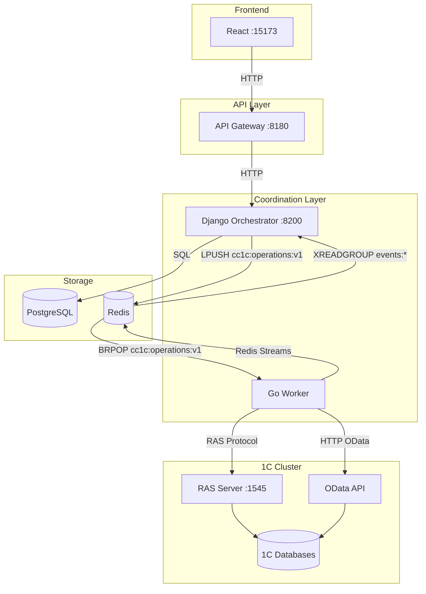

# Current Architecture (as of 2025-12-11)

> **Status:** Actual
> **Version:** 1.1

## Overview

Текущая архитектура CommandCenter1C с прямыми RAS и OData операциями из Worker.

## Architecture Diagram

## Component Responsibilities

| Component | Layer | Responsibility |
|-----------|-------|----------------|
| **React Frontend** | UI | User interface |
| **API Gateway** | API | Routing, auth, rate limiting |
| **Django Orchestrator** | Coordination | API, business logic, state management |
| **Go Worker** | Coordination | Task processing, workflows, direct RAS/OData execution |

## Transport Mechanisms

| Path | Transport | Guarantee | Notes |
|------|-----------|-----------|-------|
| Django → Worker | Redis Queue (LIST) | At-most-once | LPUSH/BRPOP |
| Worker → RAS Server | RAS protocol | Direct | Lock/unlock/sessions, cluster ops |
| Worker → OData | HTTP | Direct | CRUD, batch |
| Worker → Django | Redis Streams | At-least-once | events:* consumer groups |

## Key Files

| Component | File | Function |
|-----------|------|----------|
| Django enqueue | `orchestrator/apps/operations/services/operations_service.py` | enqueue operations |
| Redis client | `orchestrator/apps/operations/redis_client.py` | LPUSH to queue |
| Worker consumer | `go-services/worker/internal/queue/consumer.go` | BRPOP from queue |
| Worker processor | `go-services/worker/internal/processor/processor.go` | Task routing |
| RAS driver | `go-services/worker/internal/drivers/rasops/` | Direct RAS operations |
| Event publisher | `go-services/worker/internal/events/publisher.go` | Redis Streams events |
| Django subscriber | `orchestrator/apps/operations/event_subscriber.py` | XREADGROUP results |

## Redis Keys

| Key Pattern | Type | Purpose |
|-------------|------|---------|
| `cc1c:operations:v1` | LIST | Task queue |
| `cc1c:task:{id}:lock` | STRING | Idempotency lock |
| `cc1c:task:{id}:progress` | HASH | Progress tracking |
| `events:*` | STREAM | Results from services |
