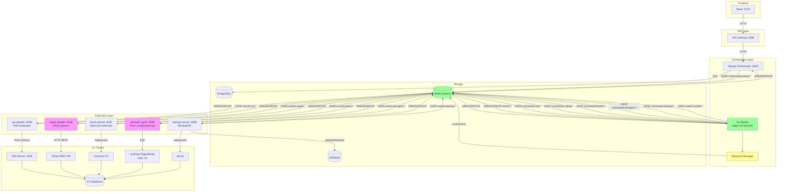
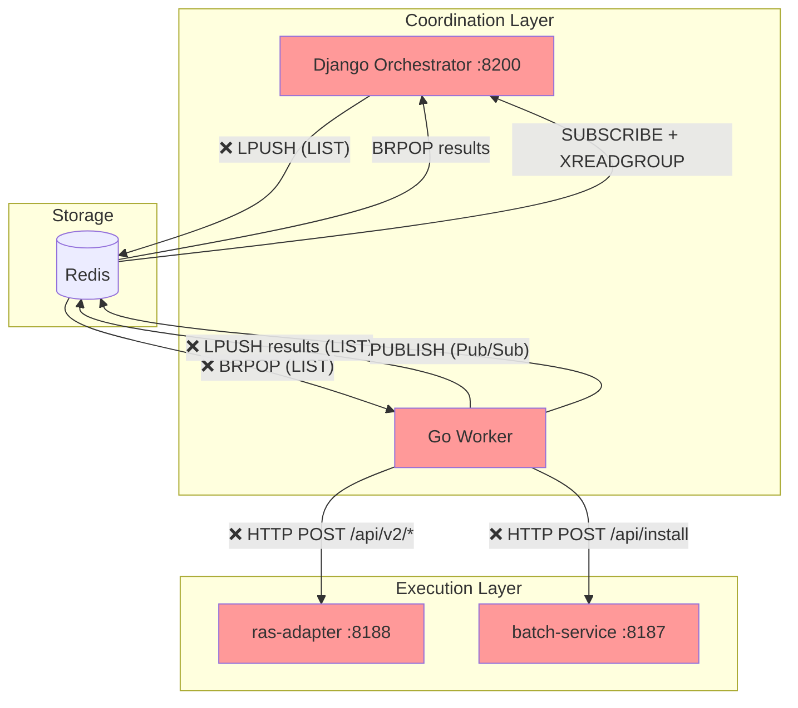
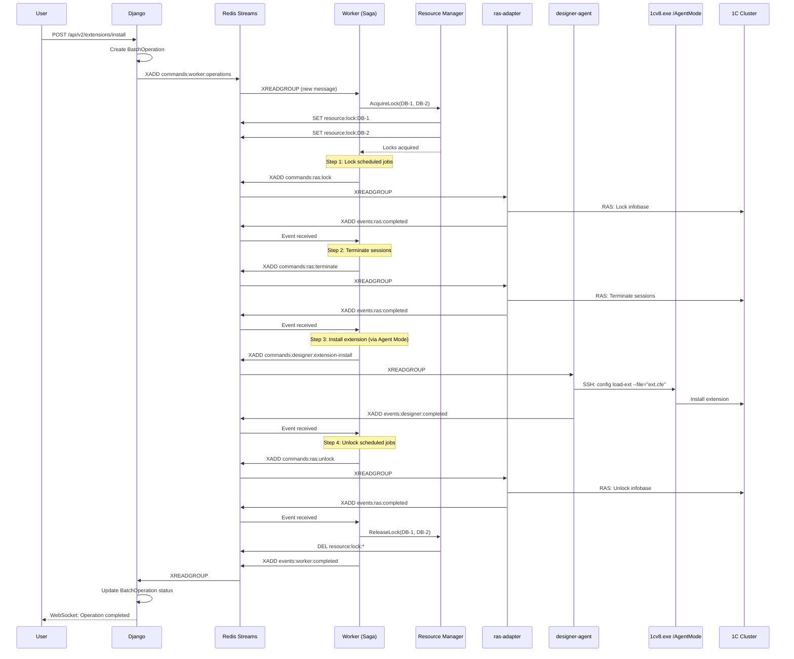
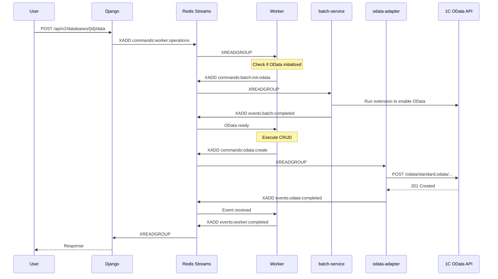

# Roadmap: Унификация транспорта и Saga Orchestration

> **Статус:** In Progress v4.0
> **Версия:** 4.0
> **Создан:** 2025-12-10
> **Обновлён:** 2025-12-12
> **Автор:** Claude Code
>
> **NOTE (2025-12-15):** Незавершённые пункты, влияющие на “SPA-primary” унификацию и контракты, перенесены в `docs/roadmaps/SPA_PRIMARY_ADMIN_UNIFICATION_ROADMAP.md`.
>
> ### Текущий прогресс
>
> | Фаза | Статус | Прогресс | Commits |
> |------|--------|----------|---------|
> | **Phase 0** | ✅ Done | 9/10 задач | `4bc7539`, `b57e88d` |
> | **Phase 1** | ✅ Done | 8/8 задач | `23e7b75`, `2be71be`, pending |
> | **Phase 1.5** | ✅ Done | 11/11 задач | pending |
> | **Phase 1.6** | ✅ Done | 11/11 задач | pending |
> | **Phase 2** | ✅ Done | 12/12 задач | pending |
> | **Phase 3** | ✅ Done | 6/8 задач | pending |
>
> **Следующий шаг:** Integration tests, production deployment
>
> **Changelog v4.1:** Phase 3 - Cleanup Legacy кода выполнен:
> - УДАЛЁН `processor/ras_handler.go` (615 строк) - заменён State Machine + Saga
> - УДАЛЁН `processor/extension_handler.go` (373 строки) - HTTP к batch-service заменён на Event-Driven
> - ОБНОВЛЁН `processor/processor.go` - удалён RASHandler
> - ОБНОВЛЁН `processor/dual_mode.go` - удалён HTTP fallback, только Event-Driven
> - ОСТАВЛЕН `rasadapter/client.go` - используется для sync_cluster, discover_clusters
> - ОСТАВЛЕН `cluster_resolver.go` - используется State Machine workflows
> - Итого удалено: ~988 строк legacy кода
> - Build и тесты проходят
>
> **Changelog v4.0:** Phase 2 - Resource Manager + Saga Compensation реализован:
> - Создан `worker/internal/resourcemanager/` - distributed locks с fair queueing
>   - Lua scripts для атомарности, Pub/Sub для уведомлений
>   - 66 тестов, покрытие 76.5%
> - Создан `worker/internal/saga/` - Saga Orchestrator с compensation
>   - types.go, store.go, compensation.go, orchestrator.go
>   - Recovery механизм для восстановления после crash
>   - 34 теста, покрытие 60.6%
> - Создан `worker/internal/saga/workflows/` - готовые workflows
>   - extension_install, extension_remove (9 шагов)
>   - simple_ras: lock/unlock, block/unblock, terminate (3 шага)
>   - odata_batch с compensation (4 шага)
>   - config_update/config_load (10-11 шагов, до 4 часов)
> - Prometheus метрики: `cc1c_resourcemanager_*`, `cc1c_saga_*`
> - Исправлены критические проблемы из code review:
>   - Race condition в SagaContext.Clone() (deep copy)
>   - Goroutine leak в SubscribeToLockRelease
>   - Type assertion panic в ExtendLock
>
> **Changelog v3.0:** Phase 1.5 batch_handler + Phase 1.6 designer-agent реализованы:
> - odata-adapter: batch_handler.go с multipart/mixed OData batch
> - odata-adapter: защита от Memory DoS (io.LimitReader), уникальные boundary, валидация EntityID
> - Создан `go-services/shared/designer/` (types.go, channels.go + тесты)
> - Создан `go-services/designer-agent/` микросервис
> - SSH клиент с connection pool и keep-alive
> - Event handlers: extension (install/remove), config (load/dump/update), epf (export)
> - Порт: 8086, Redis Streams: `commands:designer:*` → `events:designer:*`
> - 217+ тестов, покрытие >95%
>
> **Changelog v2.9:** Phase 1.5 (odata-adapter) реализован:
> - Создан `go-services/shared/odata/` (types.go, channels.go + тесты)
> - Создан `go-services/odata-adapter/` микросервис
> - OData HTTP client с connection pool
> - Event handlers: query, create, update, delete
> - Порт: 8189, Redis Streams: `commands:odata:*` → `events:odata:*`
> - Batch handler отложен на следующую итерацию
>
> **Changelog v2.8:** Phase 1 завершён:
> - lock_handler.go, unlock_handler.go, terminate_handler.go обновлены на новый паттерн
> - Все handlers используют `ras.RASCommand` и `ras.RASResult`
> - Channels: `commands:ras:*` → `events:ras:completed/failed`
> - Все 30 тестов проходят
>
> **Changelog v2.7:** Добавлена таблица прогресса
>
> **Changelog v2.6:** Phase 1 частично реализован (commit 23e7b75):
> - shared/ras: types.go, channels.go с тестами
> - ras-adapter: block_handler.go, unblock_handler.go
> - Worker: StreamClient, ResponseWaiter, dual-mode в ras_handler.go
> - Feature flag: RAS_TRANSPORT=http|streams
>
> **Changelog v2.5:** Phase 0 реализован (commit 4bc7539):
> - Django → Worker: LPUSH → XADD (redis_client.py)
> - Worker consume: BRPOP → XREADGROUP (stream_consumer.go)
> - Results: LPUSH → XADD events:worker:completed/failed
> - Django subscribe: events:worker:* via XREADGROUP
> - Удалён legacy код: consumer.go, redis.go, pool/
>
> **Changelog v2.4:** Верификация против исходного кода:
> - Фаза 0: добавлена миграция results queue (consumer.go:132 LPUSH → XADD)
> - Фаза 2: добавлена ссылка на scheduler/locks.go как базу для Resource Manager
> - Фаза 3: добавлен extension_handler.go (~372 строк) в cleanup list

---

## Цель

Унифицировать транспорт между сервисами на Redis Streams и реализовать Saga Orchestration для надёжного выполнения распределённых транзакций над 700+ базами 1С.

### Бизнес-требования

- **Много пользователей** — параллельные запросы на разные базы
- **Консистентность** — "умная транзакция" в рамках workflow
- **Isolation** — пока workflow работает с базой, другие ждут
- **Compensation** — откат при ошибке на любом шаге
- **Durability** — состояние workflow не теряется при падении

---

## Архитектура

### Полная архитектура системы



### Execution Layer — все адаптеры

```
┌───────────────────────────────────────────────────────────────────────────────────────────────────────┐
│                                         EXECUTION LAYER                                                │
│                                   (stateless адаптеры к 1С)                                            │
├───────────────────────────────────────────────────────────────────────────────────────────────────────┤
│                                                                                                        │
│  ras-adapter        odata-adapter       batch-service       designer-agent      backup-service        │
│  "Управление        "CRUD данных"       "Простые            "Агент              "Backup/DR"           │
│   кластером"                             пакетные"           конфигуратора"                           │
│  ✅ EXISTS          🔴 NEW              ✅ EXISTS           🔴 NEW              🔴 PLANNED            │
│  :8188              :8189               :8187               :8086               :8089                 │
│                                                                                                        │
│  • lock/unlock      • read records      • init OData        • extensions        • dump → .dt          │
│  • block/unblock    • write records     • simple cmds       • UpdateDBCfg       • restore             │
│  • terminate        • batch CRUD                            • load/dump cfg     • replicate           │
│  • get sessions     • queries                               • EPF/ERF export                          │
│                                                                                                        │
│  Протокол:          Протокол:           Инструмент:         Протокол:           Инструмент:           │
│  RAS TCP :1545      HTTP OData REST     1cv8.exe CLI        SSH → /AgentMode    ibcmd                 │
│                                                                                                        │
│  SLA: секунды       SLA: <15 сек        SLA: секунды        SLA: секунды        SLA: мин-часы         │
│                     (КРИТИЧНО!)                             (persistent conn)                          │
│                                                                                                        │
│  commands:ras:*     commands:odata:*    commands:batch:*    commands:designer:* commands:backup:*     │
│  events:ras:*       events:odata:*      events:batch:*      events:designer:*   events:backup:*       │
│                                                                                                        │
└───────────────────────────────────────────────────────────────────────────────────────────────────────┘
                                                   │
                                                   ▼
┌───────────────────────────────────────────────────────────────────────────────────────────────────────┐
│                                            1С CLUSTER                                                  │
│                                                                                                        │
│  ┌──────────────┐  ┌──────────────┐  ┌──────────────┐  ┌──────────────┐  ┌──────────────┐             │
│  │ RAS Server   │  │ OData API    │  │ 1cv8.exe     │  │ 1cv8.exe     │  │ ibcmd        │             │
│  │ :1545        │  │ :80/443      │  │ CLI mode     │  │ /AgentMode   │  │ subprocess   │             │
│  │              │  │              │  │              │  │ SSH :22      │  │              │             │
│  │ Управление   │  │ CRUD данных  │  │ Простые      │  │ Конфигуратор │  │ Backup/DR    │             │
│  │ кластером    │  │ (требует     │  │ команды      │  │ persistent   │  │ Репликация   │             │
│  │              │  │  init!)      │  │              │  │              │  │              │             │
│  └──────────────┘  └──────────────┘  └──────────────┘  └──────────────┘  └──────────────┘             │
│         │                 │                 │                 │                 │                      │
│         └─────────────────┴─────────────────┴─────────────────┴─────────────────┘                      │
│                                                   │                                                    │
│                                            1С Databases                                                │
└───────────────────────────────────────────────────────────────────────────────────────────────────────┘
```

### OData: зависимость от batch-service

OData REST API базы 1С требует предварительной инициализации доступа к метаданным.

```
┌─────────────────────────────────────────────────────────────────┐
│                    OData Initialization Flow                     │
└─────────────────────────────────────────────────────────────────┘

                    1. Init OData Access
Worker ─────────────────────────────────────────► batch-service
                                                       │
                                                       ▼
                                            Запускает расширение
                                            или внешнюю обработку
                                            в базе 1С
                                                       │
                                                       ▼
                                            База открывает
                                            OData REST API
                                                       │
                    2. CRUD операции                   │
Worker ─────────────────────────────────────────► odata-adapter
                                                       │
                                                       ▼
                                            HTTP запросы к
                                            OData REST API базы
```

### Двухуровневая архитектура

```
┌─────────────────────────────────────────────────────────────────┐
│                    COORDINATION LAYER                            │
│              (workflows, бизнес-логика, блокировки)              │
├─────────────────────────────────────────────────────────────────┤
│  Django         — API, валидация, состояние операций            │
│  Worker         — Saga Orchestrator, State Machines             │
│  Resource Mgr   — Distributed locks на базы данных              │
└─────────────────────────────────────────────────────────────────┘
                              │
                              │ Redis Streams (единый транспорт)
                              │
                              │ commands:worker:*    (Django → Worker)
                              │ commands:ras:*       (Worker → ras-adapter)
                              │ commands:odata:*     (Worker → odata-adapter)
                              │ commands:batch:*     (Worker → batch-service)
                              │ commands:designer:*  (Worker → designer-agent)
                              │ commands:backup:*    (Worker → backup-service)
                              │ events:*             (Results → Worker/Django)
                              ▼
┌─────────────────────────────────────────────────────────────────┐
│                    EXECUTION LAYER                               │
│              (stateless адаптеры к 1С)                           │
├─────────────────────────────────────────────────────────────────┤
│  ras-adapter     — RAS операции (lock, unlock, sessions)        │
│  odata-adapter   — CRUD данных (read, write, batch, queries)    │
│  batch-service   — Простые пакетные (init OData, simple cmds)   │
│  designer-agent  — Агент конфигуратора (extensions, config)     │
│  backup-service  — Disaster Recovery (dump, restore, replicate) │
└─────────────────────────────────────────────────────────────────┘
                              │
                              │ Native протоколы
                              ▼
┌─────────────────────────────────────────────────────────────────┐
│                         1С CLUSTER                               │
└─────────────────────────────────────────────────────────────────┘
```

---

## Текущее состояние (проблема: 3 разных транспорта)



**Проблемы:**
| Путь | Транспорт | Проблема |
|------|-----------|----------|
| Django → Worker | Redis LIST (`cc1c:operations:v1`) | At-most-once, нет retry |
| Worker → ras-adapter | HTTP REST (`/api/v2/*`) | Синхронный, blocking |
| Worker → batch-service | **HTTP REST** (`/api/install`) | Синхронный, blocking |
| Results → Django | Redis LIST | At-most-once |
| Events → Django | Pub/Sub + Streams (mixed) | Сложно, не единообразно |

### Ключевые файлы для миграции

| Путь | Файлы | Изменение |
|------|-------|-----------|
| Django → Worker | `redis_client.py`, `operations_service.py` | LPUSH → XADD |
| Worker consume | `consumer.go` | BRPOP → XREADGROUP |
| Worker → ras-adapter | `rasadapter/client.go`, `ras_handler.go` | HTTP → XADD |
| Worker → batch-service | `extension_handler.go` | HTTP → XADD |
| ras-adapter | `cmd/main.go`, новые handlers | HTTP → XREADGROUP |
| batch-service | `cmd/main.go`, новые handlers | HTTP → XREADGROUP |
| Events → Django | `event_subscriber.py`, `publisher.go` | Унификация на Streams |

---

## Redis Streams vs Redis LIST

| Аспект | LIST (сейчас) | STREAM (целевой) |
|--------|---------------|------------------|
| Гарантия | At-most-once | At-least-once |
| После чтения | Удаляется | Сохраняется |
| Consumer Groups | ❌ | ✅ |
| Acknowledge | ❌ | ✅ XACK |
| Retry failed | ❌ Потеряно | ✅ XPENDING + XCLAIM |
| История | ❌ | ✅ |
| Масштабирование | BRPOP конкуренция | Consumer Groups |

---

## Saga Pattern: Workflow как транзакция

### Пример: extension_install

```
Workflow: extension_install (User2 на DB-2, DB-5)

┌─────────────────────────────────────────────────────────────────┐
│  Step 1: acquire_locks(DB-2, DB-5)                              │
│          → compensation: release_locks()                        │
├─────────────────────────────────────────────────────────────────┤
│  Step 2: lock_scheduled_jobs()              [ras-adapter]       │
│          → compensation: unlock_scheduled_jobs()                │
├─────────────────────────────────────────────────────────────────┤
│  Step 3: terminate_sessions()               [ras-adapter]       │
│          → compensation: (none)                                 │
├─────────────────────────────────────────────────────────────────┤
│  Step 4: install_extension()                [batch-service]     │
│          → compensation: uninstall_extension()                  │
├─────────────────────────────────────────────────────────────────┤
│  Step 5: unlock_scheduled_jobs()            [ras-adapter]       │
│          → compensation: (none)                                 │
├─────────────────────────────────────────────────────────────────┤
│  Step 6: release_locks()                                        │
│          → compensation: (none)                                 │
└─────────────────────────────────────────────────────────────────┘

Если Step 4 падает → выполняем compensations:
  unlock_scheduled_jobs() → release_locks()
```

### Resource Manager: блокировки баз

```
База DB-1:
├── Owner: workflow-123 (User1)
├── Operation: update_release
├── Locked at: 2025-12-11 10:00
├── TTL: 15 минут
└── Queue: [workflow-456 (User3) waiting...]

База DB-2:
├── Owner: workflow-123 (User1)
├── Operation: update_release
└── Queue: [workflow-789 (User2) waiting...]
```

---

## Фазы миграции

### Фаза 0: Миграция Django → Worker на Streams

**Цель:** Заменить Redis LIST на Redis Streams для надёжной доставки задач.

**Изменения:**

| Компонент | Было | Станет |
|-----------|------|--------|
| Django | `LPUSH cc1c:operations:v1` | `XADD commands:worker:operations` |
| Worker | `BRPOP cc1c:operations:v1` | `XREADGROUP ... commands:worker:operations` |
| Worker (results) | `LPUSH cc1c:operations:results:v1` | `XADD events:worker:completed` |
| Django (results) | `BRPOP results` | `XREADGROUP events:worker:*` |

**Файлы для изменения:**

```
orchestrator/apps/operations/redis_client.py          # LPUSH → XADD
go-services/worker/internal/queue/consumer.go         # BRPOP → XREADGROUP
go-services/worker/cmd/main.go                        # Consumer Group setup
```

**Subtasks:**
- [x] 0.1: Создать consumer group `worker-group` при старте Worker ✅ `stream_consumer.go:EnsureConsumerGroup()`
- [x] 0.2: Заменить `BRPOP` на `XREADGROUP` в consumer.go ✅ `stream_consumer.go:Start()`
- [x] 0.3: Добавить `XACK` после успешной обработки ✅ `stream_consumer.go:ackMessage()`
- [x] 0.4: Реализовать retry через `XPENDING` + `XCLAIM` ✅ `stream_consumer.go:claimStalledMessages()`
- [x] 0.5: Заменить `LPUSH` на `XADD` в Django redis_client.py ✅ `redis_client.py:enqueue_operation_stream()`
- [x] 0.6: Обновить формат сообщения (добавить correlation_id) ✅ `redis_client.py:_create_envelope()`
- [x] 0.7: **Results queue:** Заменить `LPUSH results` на `XADD events:worker:*` ✅ `stream_consumer.go:publishCompletedResult()/publishFailedResult()`
- [x] 0.8: **Results queue:** Django подписка на `events:worker:*` вместо `BRPOP` ✅ `event_subscriber.py`
- [ ] 0.9: Integration tests ⏸️ **ОТЛОЖЕНО** — реализуем после Фазы 2 и ручной проверки работоспособности (moved → `docs/roadmaps/SPA_PRIMARY_ADMIN_UNIFICATION_ROADMAP.md`)
- [x] 0.10: Мониторинг: pending messages, consumer lag ✅ `stream_consumer.go:GetStreamDepth()/GetPendingCount()`

**Критерии завершения:**
- [x] Worker читает из Stream вместо LIST
- [x] Acknowledge после успешной обработки
- [x] Retry зависших сообщений работает
- [ ] Zero message loss при restart Worker (ручная проверка, затем интеграционные тесты) (moved → `docs/roadmaps/SPA_PRIMARY_ADMIN_UNIFICATION_ROADMAP.md`)

---

### Фаза 1: Миграция Worker → ras-adapter на Streams

**Цель:** Заменить HTTP вызовы на Redis Streams для async коммуникации.

**Изменения:**

| Компонент | Было | Станет |
|-----------|------|--------|
| Worker | HTTP POST к ras-adapter | `XADD commands:ras:*` |
| ras-adapter | HTTP handlers | Redis Streams consumer |

**Новые Streams:**

```
commands:ras:lock           # lock_scheduled_jobs
commands:ras:unlock         # unlock_scheduled_jobs
commands:ras:block          # block_sessions
commands:ras:unblock        # unblock_sessions
commands:ras:terminate      # terminate_sessions

events:ras:completed        # Успешные результаты
events:ras:failed           # Ошибки
```

**Файлы для создания/изменения:**

```
# Worker
go-services/worker/internal/processor/ras_handler.go     # HTTP → Stream publish
go-services/worker/internal/events/ras_subscriber.go     # NEW: подписка на events:ras:*

# ras-adapter (handlers уже есть, нужно подключить)
go-services/ras-adapter/internal/eventhandlers/block_handler.go    # NEW
go-services/ras-adapter/internal/eventhandlers/unblock_handler.go  # NEW
go-services/ras-adapter/cmd/main.go                                # Регистрация handlers
```

**Subtasks:**
- [x] 1.1: Создать block_handler.go в ras-adapter ✅ `eventhandlers/block_handler.go`
- [x] 1.2: Создать unblock_handler.go в ras-adapter ✅ `eventhandlers/unblock_handler.go`
- [x] 1.3: Зарегистрировать все handlers в main.go ✅ `cmd/main.go`
- [x] 1.4: Worker: заменить HTTP вызовы на XADD ✅ `rasadapter/stream_client.go`
- [x] 1.5: Worker: подписаться на events:ras:* для получения результатов ✅ `rasadapter/response_waiter.go`
- [x] 1.6: Добавить timeout при ожидании события ✅ 30s default, configurable
- [x] 1.7: Обновить lock/unlock/terminate handlers на новый паттерн ✅ 2025-12-12
- [x] 1.8: Unit tests для всех handlers ✅ 30 тестов проходят

**Дополнительно реализовано:**
- `shared/ras/types.go` - RASCommand, RASResult с валидацией
- `shared/ras/channels.go` - константы каналов
- Dual-mode в `ras_handler.go` с feature flag `RAS_TRANSPORT`
- Thread-safe StreamClient с mutex protection
- lock_handler.go, unlock_handler.go, terminate_handler.go на новом паттерне

**Критерии завершения:**
- [x] Block/Unblock операции работают через Streams
- [x] Все 5 RAS операций работают через Streams ✅ 2025-12-12
- [ ] HTTP endpoints в ras-adapter deprecated (Phase 3) (moved → `docs/roadmaps/SPA_PRIMARY_ADMIN_UNIFICATION_ROADMAP.md`)
- [ ] Latency < 100ms (p99) (требуется тестирование) (moved → `docs/roadmaps/SPA_PRIMARY_ADMIN_UNIFICATION_ROADMAP.md`)
- [ ] Success rate >= 99% (требуется тестирование) (moved → `docs/roadmaps/SPA_PRIMARY_ADMIN_UNIFICATION_ROADMAP.md`)

---

### Фаза 1.5: Создание odata-adapter

**Цель:** Создать адаптер для CRUD операций с данными 1С через OData REST API.

**Новый сервис:**

```
go-services/odata-adapter/
├── cmd/
│   └── main.go
├── internal/
│   ├── api/                    # Health endpoint
│   ├── eventhandlers/
│   │   ├── query_handler.go    # SELECT operations
│   │   ├── create_handler.go   # INSERT operations
│   │   ├── update_handler.go   # UPDATE operations
│   │   ├── delete_handler.go   # DELETE operations
│   │   └── batch_handler.go    # Batch operations
│   ├── odata/
│   │   ├── client.go           # HTTP client to OData API
│   │   ├── query_builder.go    # OData query construction
│   │   └── response_parser.go  # Response parsing
│   └── config/
│       └── config.go
├── Dockerfile
└── README.md
```

**Streams:**

```
# Commands
commands:odata:query          # SELECT
commands:odata:create         # INSERT
commands:odata:update         # UPDATE
commands:odata:delete         # DELETE
commands:odata:batch          # Batch CRUD

# Events
events:odata:completed        # Успешные результаты
events:odata:failed           # Ошибки
```

**Subtasks:**
- [x] 1.5.1: Создать структуру go-services/odata-adapter/ ✅
- [x] 1.5.2: Реализовать OData HTTP client ✅ `internal/odata/client.go`, `pool.go`
- [x] 1.5.3: Реализовать query_handler.go ✅
- [x] 1.5.4: Реализовать create_handler.go ✅
- [x] 1.5.5: Реализовать update_handler.go ✅
- [x] 1.5.6: Реализовать delete_handler.go ✅
- [x] 1.5.7: Реализовать batch_handler.go ✅ multipart/mixed OData batch
- [x] 1.5.8: Добавить поддержку OData $filter, $select, $expand ✅ `helpers.go:BuildQueryString()`
- [x] 1.5.9: Unit tests ✅ 80+ тестов (shared/odata + odata-adapter)
- [ ] 1.5.10: Integration tests ⏸️ **ОТЛОЖЕНО** до Phase 2 (moved → `docs/roadmaps/SPA_PRIMARY_ADMIN_UNIFICATION_ROADMAP.md`)
- [ ] 1.5.11: Dockerfile + docker-compose ⏸️ **ОТЛОЖЕНО** (moved → `docs/roadmaps/SPA_PRIMARY_ADMIN_UNIFICATION_ROADMAP.md`)

**Дополнительно реализовано:**
- `go-services/shared/odata/` - types.go, channels.go с тестами
- Connection pool для HTTP транспортов
- Credentials передаются в каждой команде (не кэшируются)
- Порт: 8189
- batch.go: buildBatchBody(), parseBatchResponse() с multipart/mixed
- BatchResult, BatchItemResult типы с детальным статусом каждой операции
- Защита от Memory DoS (io.LimitReader 50MB)
- Уникальные boundary (crypto/rand)
- Валидация EntityID формата (guid'...')

**Критерии завершения:**
- [x] Все CRUD операции работают через Streams ✅
- [x] Поддержка batch операций (100-500 records) ✅ MaxBatchSize=100
- [x] SLA < 15 секунд для транзакций ✅ MaxBatchTimeout = 14s
- [ ] Success rate >= 99% (требуется production тестирование) (moved → `docs/roadmaps/SPA_PRIMARY_ADMIN_UNIFICATION_ROADMAP.md`)

---

### Фаза 1.6: Создание designer-agent (Агент конфигуратора)

**Цель:** Создать сервис для работы с 1С через режим агента конфигуратора (SSH → /AgentMode).

**Преимущества перед batch-service:**

| Аспект | batch-service (subprocess) | designer-agent (SSH) |
|--------|---------------------------|----------------------|
| Запуск | Новый процесс на команду | Persistent connection |
| Подключение к базе | Каждый раз заново | Один раз |
| Overhead | Высокий | Низкий |
| Последовательные команды | N запусков | 1 соединение, N команд |

**Новый сервис:**

```
go-services/designer-agent/
├── cmd/
│   └── main.go
├── internal/
│   ├── api/                    # Health endpoint
│   ├── eventhandlers/
│   │   ├── extension_handler.go    # Установка/удаление расширений
│   │   ├── config_handler.go       # UpdateDBCfg, load/dump cfg
│   │   ├── epf_handler.go          # Экспорт/импорт EPF/ERF
│   │   └── metadata_handler.go     # Работа с метаданными
│   ├── ssh/
│   │   ├── client.go               # SSH client (Paramiko-style)
│   │   ├── session_pool.go         # Pool соединений к агентам
│   │   └── command.go              # Command builder
│   └── config/
│       └── config.go
├── Dockerfile
└── README.md
```

**Streams:**

```
# Commands
commands:designer:extension-install   # Установка расширения
commands:designer:extension-remove    # Удаление расширения
commands:designer:config-update       # UpdateDBCfg
commands:designer:config-load         # Загрузить конфигурацию
commands:designer:config-dump         # Выгрузить конфигурацию
commands:designer:epf-export          # Экспорт внешних обработок

# Events
events:designer:completed             # Успешные результаты
events:designer:failed                # Ошибки
events:designer:progress              # Прогресс (для длительных операций)
```

**Как работает агент конфигуратора:**

```bash
# 1. Запуск агента на сервере 1С
1cv8.exe DESIGNER /IBName "база" /AgentMode /AgentSSHHostKeyAuto /AgentBaseDir "path"

# 2. designer-agent подключается по SSH
ssh user@1c-server -p 22

# 3. Выполняет команды без перезапуска
> config load-cfg --file="config.cf"
> config update-db-cfg
> config dump-ext-files --ext-file="report.erf" --file="report_xml/"
```

**Subtasks:**
- [x] 1.6.1: Создать структуру go-services/designer-agent/ ✅
- [x] 1.6.2: Реализовать SSH client с поддержкой connection pooling ✅ `internal/ssh/client.go`
- [x] 1.6.3: Реализовать session_pool для нескольких баз ✅ `internal/ssh/pool.go`
- [x] 1.6.4: Реализовать extension_handler.go ✅ install/remove
- [x] 1.6.5: Реализовать config_handler.go ✅ load/dump/update (timeout до 4 часов)
- [x] 1.6.6: Реализовать epf_handler.go ✅ export EPF/ERF
- [x] 1.6.7: Добавить health check и metrics ✅ `/health`, `/ready`
- [x] 1.6.8: Unit tests ✅ 217+ тестов, покрытие >95%
- [ ] 1.6.9: Integration tests с mock SSH server ⏸️ **ОТЛОЖЕНО** до Phase 2 (moved → `docs/roadmaps/SPA_PRIMARY_ADMIN_UNIFICATION_ROADMAP.md`)
- [ ] 1.6.10: Dockerfile + docker-compose ⏸️ **ОТЛОЖЕНО** (moved → `docs/roadmaps/SPA_PRIMARY_ADMIN_UNIFICATION_ROADMAP.md`)
- [ ] 1.6.11: Документация по настройке агента на сервере 1С ⏸️ **ОТЛОЖЕНО** (moved → `docs/roadmaps/SPA_PRIMARY_ADMIN_UNIFICATION_ROADMAP.md`)

**Дополнительно реализовано:**
- `go-services/shared/designer/` - types.go, channels.go с тестами
- SSH клиент с keep-alive и reconnect logic
- Connection pool по ключу host:port с idle cleanup
- Command builder для всех операций 1C Designer
- Progress events для длительных операций
- Credentials передаются в каждой команде (безопасность)
- Порт: 8086

**Критерии завершения:**
- [x] Persistent SSH соединение к агенту конфигуратора ✅
- [x] Поддержка пула соединений для нескольких баз ✅
- [x] Операции с расширениями работают через Streams ✅
- [x] UpdateDBCfg работает через Streams ✅ (timeout 4 часа)
- [ ] Success rate >= 99% (требуется production тестирование) (moved → `docs/roadmaps/SPA_PRIMARY_ADMIN_UNIFICATION_ROADMAP.md`)

**См. также:**
- [Режим агента конфигуратора](https://wonderland.v8.1c.ru/blog/rezhim-agenta-konfiguratora/)

---

### Фаза 2: Resource Manager + Saga Compensation

**Цель:** Реализовать блокировки баз и откат при ошибках.

**Компоненты:**

> **Примечание:** Существующий код `scheduler/locks.go` содержит базовые функции
> `AcquireLock`, `ReleaseLock`, `ExtendLock` — можно использовать как основу.

```
go-services/worker/internal/resourcemanager/
├── manager.go           # Acquire/Release locks (расширить scheduler/locks.go)
├── lock.go              # Lock struct, TTL, queue
└── store.go             # Redis storage for locks

go-services/worker/internal/saga/
├── orchestrator.go      # Saga execution engine
├── step.go              # Step with compensation
├── compensation.go      # Compensation executor
└── workflows/
    ├── extension_install.go
    ├── release_update.go
    ├── odata_batch.go   # OData batch workflow
    └── simple_ras.go    # lock/unlock/block/terminate
```

**Redis структуры для блокировок:**

```
# Lock на базу
resource:lock:{database_id}
├── owner: workflow-{id}
├── operation: extension_install
├── locked_at: timestamp
├── ttl: 900 (15 min)
└── correlation_id: uuid

# Очередь ожидания
resource:queue:{database_id}  # LIST of waiting workflow IDs

# Состояние workflow (для recovery)
workflow:state:{workflow_id}
├── current_step: 3
├── completed_steps: [1, 2]
├── compensation_stack: [unlock, release]
└── status: running|completed|compensating|failed
```

**Subtasks:**
- [x] 2.1: Реализовать ResourceManager.AcquireLock() ✅ `resourcemanager/manager.go`
- [x] 2.2: Реализовать ResourceManager.ReleaseLock() ✅ `resourcemanager/manager.go`
- [x] 2.3: Реализовать очередь ожидания на базу ✅ Fair queueing через ZSET
- [x] 2.4: Реализовать Saga Orchestrator ✅ `saga/orchestrator.go`
- [x] 2.5: Реализовать Compensation Executor ✅ `saga/compensation.go`
- [x] 2.6: Workflow: extension_install с compensation ✅ `workflows/extension_install.go`
- [x] 2.7: Workflow: simple_ras (обёртка для простых операций) ✅ `workflows/simple_ras.go`
- [x] 2.8: Workflow: odata_batch (OData операции с compensation) ✅ `workflows/odata_batch.go`
- [x] 2.9: Persistence состояния workflow в Redis ✅ `saga/store.go`
- [x] 2.10: Recovery после restart Worker ✅ `saga/recovery.go`
- [x] 2.11: Unit tests ✅ 105 тестов (resourcemanager: 66, saga: 34, workflows: 5)
- [ ] 2.12: Integration tests с имитацией failures ⏸️ **ОТЛОЖЕНО** до Phase 3 (moved → `docs/roadmaps/SPA_PRIMARY_ADMIN_UNIFICATION_ROADMAP.md`)

**Дополнительно реализовано:**
- `worker/internal/resourcemanager/` - distributed locks с Lua scripts
- `worker/internal/saga/types.go` - Step, SagaDefinition, SagaContext, SagaState
- `worker/internal/saga/workflows/config_update.go` - UpdateDBCfg (до 4 часов)
- Prometheus метрики: `cc1c_resourcemanager_*`, `cc1c_saga_*`
- RecoveryManager с стратегиями: Resume, Compensate, Manual

**Критерии завершения:**
- [x] Конфликтующие операции на одну базу выстраиваются в очередь ✅ Fair FIFO queue
- [x] При ошибке выполняется compensation ✅ CompensationExecutor
- [x] Состояние workflow переживает restart ✅ RecoveryManager
- [x] Нет deadlocks ✅ TTL на locks, cleanup worker

---

### Фаза 3: Cleanup Legacy кода

**Цель:** Удалить устаревший код после стабилизации.

**Файлы для удаления:**

```
# Worker (HTTP клиенты к адаптерам)
go-services/worker/internal/rasadapter/client.go           # DELETE (~456 строк)
go-services/worker/internal/processor/ras_handler.go       # DELETE (~484 строк)
go-services/worker/internal/processor/cluster_resolver.go  # DELETE (~371 строк)
go-services/worker/internal/processor/extension_handler.go # DELETE (~372 строк) - HTTP к batch-service

# Django (старая очередь)
# Код LPUSH после миграции на XADD
```

**Subtasks:**
- [x] 3.1: ~~Удалить rasadapter/client.go~~ → ОСТАВЛЕН (используется sync_cluster, discover_clusters, cluster_health) ✅
- [x] 3.2: Удалить старый ras_handler.go ✅ (615 строк)
- [x] 3.3: ~~Удалить cluster_resolver.go~~ → ОСТАВЛЕН (используется State Machine) ✅
- [x] 3.4: Удалить extension_handler.go (HTTP клиент к batch-service) ✅ (373 строки)
- [x] 3.5: Очистить processor.go от legacy imports ✅
- [ ] 3.6: Удалить HTTP endpoints из ras-adapter (после deprecation period) ⏸️ **ОТЛОЖЕНО** (moved → `docs/roadmaps/SPA_PRIMARY_ADMIN_UNIFICATION_ROADMAP.md`)
- [x] 3.7: Обновить документацию ✅
- [x] 3.8: Verify zero compilation warnings ✅ `go build ./...`, `go vet ./...`

**Критерии завершения:**
- [x] Нет legacy HTTP paths в Worker ✅ Event-Driven only
- [x] Нет неиспользуемого кода ✅ (~988 строк удалено)
- [x] Документация актуальна ✅

---

## Redis Streams: Naming Convention

```
# Commands (запросы на выполнение)
commands:worker:operations     # Django → Worker

commands:ras:lock              # Worker → ras-adapter
commands:ras:unlock
commands:ras:block
commands:ras:unblock
commands:ras:terminate

commands:odata:query           # Worker → odata-adapter
commands:odata:create
commands:odata:update
commands:odata:delete
commands:odata:batch

commands:batch:init-odata      # Worker → batch-service (простые команды)

commands:designer:extension-install   # Worker → designer-agent
commands:designer:extension-remove
commands:designer:config-update
commands:designer:config-load
commands:designer:config-dump
commands:designer:epf-export

commands:backup:dump           # Worker → backup-service
commands:backup:restore
commands:backup:replicate

# Events (результаты)
events:ras:completed           # ras-adapter → Worker
events:ras:failed

events:odata:completed         # odata-adapter → Worker
events:odata:failed

events:batch:completed         # batch-service → Worker
events:batch:failed

events:designer:completed      # designer-agent → Worker
events:designer:failed
events:designer:progress

events:backup:completed        # backup-service → Worker
events:backup:failed
events:backup:progress

events:worker:completed        # Worker → Django
events:worker:failed
events:worker:progress

# Consumer Groups
worker-group                   # Workers consuming commands:worker:*
ras-adapter-group              # ras-adapter consuming commands:ras:*
odata-adapter-group            # odata-adapter consuming commands:odata:*
batch-service-group            # batch-service consuming commands:batch:*
designer-agent-group           # designer-agent consuming commands:designer:*
backup-service-group           # backup-service consuming commands:backup:*
orchestrator-group             # Django consuming events:worker:*
```

---

## Message Format

```json
{
  "id": "msg-uuid",
  "correlation_id": "workflow-uuid",
  "type": "lock_scheduled_jobs",
  "payload": {
    "database_id": "db-uuid",
    "cluster_id": "cluster-uuid",
    "infobase_id": "infobase-uuid",
    "options": {}
  },
  "metadata": {
    "created_by": "user@example.com",
    "created_at": "2025-12-11T10:00:00Z",
    "workflow_id": "workflow-uuid",
    "step": 2,
    "retry_count": 0
  }
}
```

---

## Риски и митигация

| Риск | Вероятность | Влияние | Митигация |
|------|-------------|---------|-----------|
| Message loss при миграции | Medium | High | Dual-write период, мониторинг |
| Deadlock при блокировках | Low | High | TTL на locks, timeout на acquire |
| Worker crash mid-saga | Medium | High | Persistence в Redis, recovery |
| Redis Streams unavailable | Low | Critical | Health checks, alerting |
| Compensation fails | Low | Medium | Retry compensation, manual intervention |
| OData timeout (>15 сек) | Medium | High | Batch splitting, connection pooling |

---

## Компоненты для удаления (Phase 3 результаты)

| Файл | Строк | Статус | Причина |
|------|-------|--------|---------|
| `worker/internal/rasadapter/client.go` | ~456 | ❌ ОСТАВЛЕН | Используется sync_cluster, discover_clusters |
| `worker/internal/processor/ras_handler.go` | 615 | ✅ УДАЛЁН | Заменён на State Machine + Saga |
| `worker/internal/processor/cluster_resolver.go` | ~371 | ❌ ОСТАВЛЕН | Используется State Machine workflows |
| `worker/internal/processor/extension_handler.go` | 373 | ✅ УДАЛЁН | HTTP к batch-service → Event-Driven |
| **Итого удалено** | **~988** | | |

---

## Диаграмма: Поток данных extension_install



---

## Диаграмма: OData CRUD операции



---

## См. также

- [CURRENT_ARCHITECTURE.md](../architecture/diagrams/CURRENT_ARCHITECTURE.md) — текущая архитектура
- [EVENT_DRIVEN_ARCHITECTURE.md](../architecture/EVENT_DRIVEN_ARCHITECTURE.md) — детальный дизайн
- [ADMIN_SERVICES_ROADMAP.md](./ADMIN_SERVICES_ROADMAP.md) — backup-service, config-service
- [Saga Pattern - Microsoft](https://learn.microsoft.com/en-us/azure/architecture/patterns/saga)
- [Redis Streams](https://redis.io/docs/data-types/streams/)
